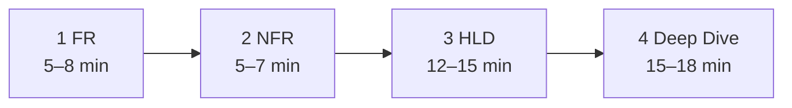
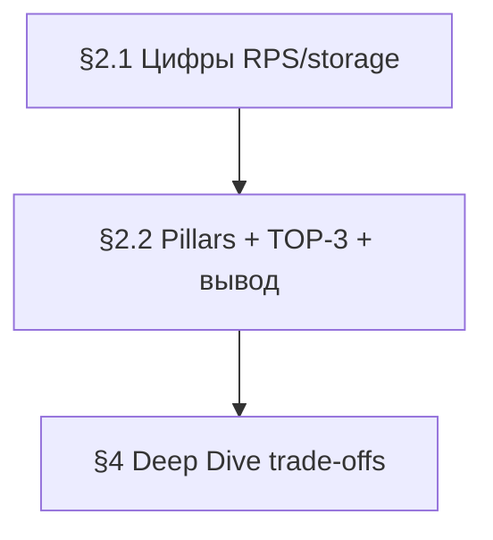

# Framework System Design

Фреймворк для прохождения system design на собесе — **формат Alex Xu, 45 мин**.

## 45-min timer

| Шаг | Время | Файл |
|-----|-------|------|
| **1. Requirements** | 5–8 min | [workflow/01-functional-requirements.md](workflow/01-functional-requirements.md) |
| **2. NFR** | 5–7 min на доске | [workflow/02-non-functional-requirements.md](workflow/02-non-functional-requirements.md) |
| **3. High-level design** | 12–15 min | [workflow/03-high-level-design.md](workflow/03-high-level-design.md) |
| **4. Deep Dive + Tech** | 15–18 min | [workflow/04-deep-dive.md](workflow/04-deep-dive.md) |



> **Deep Dive — меню, не чеклист:** интервьюер выбирает тему. Обычно **1 блок (вывод §2.2)** + **0–1 из TOP-3**. Таблица bottleneck: [workflow/04 — Routing table](workflow/04-deep-dive.md#routing-table). Примеры §4 — образец прохода, не «всё подряд».

| Пример | Начать с |
|--------|----------|
| Instagram | §4.2 |
| PayPal | §4.4 → §4.2 |
| VK messages | §4.2 |
| Nutrition app | §4.3 |
| Bulk messaging | §4.3 |

## Pillars vs Implementation trade-offs

**Три слоя — не путать:**

| Слой | Что | Где | На доске |
|------|-----|-----|----------|
| **A. Метрики** | RPS, latency, RPO/RTO, storage | **§2.1** | **цифры**, не «выбор архитектуры» |
| **B. Pillars** | availability, DR, scalability… | **§2.2** | **отметить каждый пункт** catalog + TOP-3 |
| **C. Implementation** | cache-aside, Kafka, semi-sync repl | §4 | **имена после trade-off gate** |

TOP-3 выбирается **только из слоя B** (§2.2, колонка «На доске»), не из 47 trade-off файлов напрямую.

### Как связаны §2.2 и §4

| Секция | Вопрос |
|--------|--------|
| **§2.2 pillars** | Какие **темы архитектуры** релевантны? Отметь 3 главные (TOP-3). |
| **§2.2 вывод** | С **какого блока §4** начать? (по bottleneck) |
| **§4** | Как **обосновать** выбор? (trade-offs, tech names) |

Вывод и TOP-3 не противоречат: начать можно с §4.2, а в TOP-3 есть pillar, который раскрывается в §4.3.



### Master Catalog — pillars (§2.2)

| ID | Категория | Pillar | Выбирается в | Детали в Deep Dive |
|----|-----------|--------|--------------|-------------------|
| O1 | Operational | **Availability** | §2.2 | §4.2 replication |
| O2 | Operational | **Continuity** | §2.2 | §4.1 / pull deployment |
| O3 | Operational | **DR** | §2.2 | §4.4 DR tier |
| S1 | Structural | **Scalability** | §2.2 | §4.2 cache, shard, CDN |
| S2 | Structural | **Consistency (CAP)** | §2.2 | §4.4 CAP |
| X1 | Cross-cutting | **Caching** | §2.2 | §4.2 caching-patterns |
| X2 | Cross-cutting | **Processing model** | §2.2 | §4.3 messaging, batch |
| X3 | Cross-cutting | **Observability** | §2.2 (pull) | §4 pull observability |
| X4 | Cross-cutting | **Security / Auth** | §2.2 | §4.1 gateway |
| X5 | Cross-cutting | **Distributed TX** | §2.2 | §4.3 saga-outbox |

**Pull (не в §2.2 pass):** Extensibility, Maintainability, Portability → [Pull-on-demand](#pull-on-demand-не-на-доске-по-умолчанию).

**Правило репликации:** Replication = HA/DR (O1, O3), не read scale. Read throughput → X1/S1 (CDN, cache).

## Примеры

| Пример | Паттерн |
|--------|---------|
| [instagram-feed.md](examples/instagram-feed.md) | read-heavy · X1+S1+X2 |
| [paypal-payments.md](examples/paypal-payments.md) | CP · O3+S2+X5 |
| [vk-social.md](examples/vk-social.md) | write-heavy · S1+O3+X2 |
| [open-world-mobile-game.md](examples/open-world-mobile-game.md) | 20K CCU · S1+S2+X2 |
| [nutrition-mobile-app.md](examples/nutrition-mobile-app.md) | 140K MAU · X2+X5+X1 |
| [bulk-messaging-platform.md](examples/bulk-messaging-platform.md) | 1B msg/day · X2+S1+X5 |

## Модули знаний

| Модуль | Шаг workflow | Trade-offs / examples |
|--------|--------------|------------------------|
| 1. Компоненты | 2 NFR, 3 HLD, 4 Deep Dive | LB, cache, gateway, observability |
| 2. Хранение | 3 (schema), 4.2 | indexing, sql-nosql, norm-denorm |
| 3. Распределённое | 2 NFR, 4.2–4.4 | replication, sharding, CAP |
| 4. Паттерны | 2.2 pillars, 4.3 | saga, messaging, resilience |
| 5–6. Кейсы | examples | instagram, paypal |
| 7. Capstone | vk example | vk-social |

## Шаблон trade-off

Эталон: [indexing-strategy.md](trade-offs/data/indexing-strategy.md) · термины: [GLOSSARY.md](GLOSSARY.md)

```
> Главное (1 абзац)
## Цепочка решений (N слоёв)
## Шаг A — gate
## Шаг B — варианты (Как работает / Когда / Когда нет)
## Резюме
## FAQ (собес)
## Сокращения
```

## Trade-offs

47 тем. **Когда открывать:** шаг 2 NFR (§2.2 pillars + TOP-3) · §4 implementation · Deep Dive pull · по запросу интервьюера.

### Шаг 2 NFR — §2.2 pillars

| Pillar | Trade-off |
|--------|-----------|
| O1 Availability | [replication-sync-async](trade-offs/data/replication-sync-async.md) |
| O3 DR | [disaster-recovery-pattern](trade-offs/architecture/disaster-recovery-pattern.md) · [availability-slo-rpo-rto](trade-offs/constraints/availability-slo-rpo-rto.md) |
| S1 Scalability | [sharding-partitioning](trade-offs/data/sharding-partitioning.md) · [vertical-vs-horizontal-scaling](trade-offs/constraints/vertical-vs-horizontal-scaling.md) |
| S2 Consistency | [cap-pacelc-distributed](trade-offs/architecture/cap-pacelc-distributed.md) |
| X1 Caching | [caching-patterns](trade-offs/architecture/caching-patterns.md) · [cdn-object-storage-pattern](trade-offs/architecture/cdn-object-storage-pattern.md) |
| X2 Processing | [messaging-patterns](trade-offs/architecture/messaging-patterns.md) · [batch-vs-stream](trade-offs/architecture/batch-vs-stream.md) |
| X4 Security | [resilience-backpressure](trade-offs/architecture/resilience-backpressure.md) |
| X5 Distributed TX | [saga-vs-outbox](trade-offs/architecture/saga-vs-outbox.md) |

### Pillars → §4 implementation

| Pillar | Implementation trade-offs |
|--------|---------------------------|
| X1 Caching | [caching-patterns](trade-offs/architecture/caching-patterns.md) · [push-vs-pull-delivery](trade-offs/api/push-vs-pull-delivery.md) |
| S1 Scalability | [sharding-partitioning](trade-offs/data/sharding-partitioning.md) · [sql-vs-nosql-paradigm](trade-offs/data/sql-vs-nosql-paradigm.md) |
| X2 Processing | [messaging-patterns](trade-offs/architecture/messaging-patterns.md) · [sync-async-messaging](trade-offs/api/sync-async-messaging.md) |
| O3 DR | [disaster-recovery-pattern](trade-offs/architecture/disaster-recovery-pattern.md) · [replication-sync-async](trade-offs/data/replication-sync-async.md) |
| S2 Consistency | [cap-pacelc-distributed](trade-offs/architecture/cap-pacelc-distributed.md) |
| X5 Distributed TX | [saga-vs-outbox](trade-offs/architecture/saga-vs-outbox.md) · [orchestration-choreography-saga](trade-offs/architecture/orchestration-choreography-saga.md) |

### Deep Dive §4.1 — Edge: LB + Gateway (O2, X4)

| Тема | Файл |
|------|------|
| Load balancing L4/L7 | [load-balancing-l4-l7](trade-offs/architecture/load-balancing-l4-l7.md) |
| Resilience & backpressure | [resilience-backpressure](trade-offs/architecture/resilience-backpressure.md) |
| Deployment / release | [deployment-release-strategies](trade-offs/architecture/deployment-release-strategies.md) |
| API gateways | [api-gateways](trade-offs/technologies/api-gateways.md) |
| Load balancers | [load-balancers-proxies](trade-offs/technologies/load-balancers-proxies.md) |

### Deep Dive §4.2 — Data: DB + Cache (S1, X1, O1)

| Тема | Файл |
|------|------|
| SQL vs NoSQL | [sql-vs-nosql-paradigm](trade-offs/data/sql-vs-nosql-paradigm.md) |
| Norm vs denorm | [normalization-denormalization](trade-offs/data/normalization-denormalization.md) |
| Indexing | [indexing-strategy](trade-offs/data/indexing-strategy.md) |
| Sharding / partition | [sharding-partitioning](trade-offs/data/sharding-partitioning.md) |
| Replication sync/async | [replication-sync-async](trade-offs/data/replication-sync-async.md) |
| Master-slave vs multi-master | [master-slave-multi-master](trade-offs/data/master-slave-multi-master.md) |
| Caching patterns | [caching-patterns](trade-offs/architecture/caching-patterns.md) |
| Cache eviction | [cache-eviction-policies](trade-offs/architecture/cache-eviction-policies.md) |
| CDN + object storage | [cdn-object-storage-pattern](trade-offs/architecture/cdn-object-storage-pattern.md) |
| Pagination | [pagination-cursor-offset](trade-offs/data/pagination-cursor-offset.md) |
| Databases | [databases](trade-offs/technologies/databases.md) |
| Caches | [caches](trade-offs/technologies/caches.md) |
| Object storage | [object-storage](trade-offs/technologies/object-storage.md) |

### Deep Dive §4.3 — Async, Messaging & Batch (X2, X5)

| Тема | Файл |
|------|------|
| Messaging patterns | [messaging-patterns](trade-offs/architecture/messaging-patterns.md) |
| Batch vs stream | [batch-vs-stream](trade-offs/architecture/batch-vs-stream.md) |
| Message brokers | [message-brokers](trade-offs/technologies/message-brokers.md) |
| Saga vs outbox | [saga-vs-outbox](trade-offs/architecture/saga-vs-outbox.md) |
| Orchestration vs choreography | [orchestration-choreography-saga](trade-offs/architecture/orchestration-choreography-saga.md) |
| Sync vs async API | [sync-async-messaging](trade-offs/api/sync-async-messaging.md) |
| RPC vs queue | [rpc-vs-queue](trade-offs/api/rpc-vs-queue.md) |

### Deep Dive §4.4 — DR, CAP & Failures (O3, S2)

| Тема | Файл |
|------|------|
| CAP / PACELC | [cap-pacelc-distributed](trade-offs/architecture/cap-pacelc-distributed.md) |
| Consistency as NFR | [consistency-as-nfr](trade-offs/constraints/consistency-as-nfr.md) |
| SLA, RPO/RTO | [availability-slo-rpo-rto](trade-offs/constraints/availability-slo-rpo-rto.md) |
| Disaster recovery | [disaster-recovery-pattern](trade-offs/architecture/disaster-recovery-pattern.md) |
| Deployment / release | [deployment-release-strategies](trade-offs/architecture/deployment-release-strategies.md) |

### Pull-on-demand (не на доске по умолчанию)

| Тема | Файл |
|------|------|
| REST vs gRPC vs GraphQL | [rest-grpc-graphql](trade-offs/api/rest-grpc-graphql.md) |
| Write idempotency | [write-api-idempotency](trade-offs/api/write-api-idempotency.md) |
| Real-time transport | [realtime-transport](trade-offs/api/realtime-transport.md) |
| API versioning | [api-versioning-evolution](trade-offs/api/api-versioning-evolution.md) |
| Latency vs throughput | [latency-vs-throughput](trade-offs/constraints/latency-vs-throughput.md) |
| Vertical vs horizontal | [vertical-vs-horizontal-scaling](trade-offs/constraints/vertical-vs-horizontal-scaling.md) |
| Observability | [observability-architecture](trade-offs/architecture/observability-architecture.md) |
| ETL pipeline | [etl-pipeline-pattern](trade-offs/architecture/etl-pipeline-pattern.md) |
| Stateless vs stateful | [stateless-stateful](trade-offs/architecture/stateless-stateful.md) |
| Technology selection | [technology-selection-meta](trade-offs/technologies/technology-selection-meta.md) |
| Monolith vs micro | [monolith-microservices](trade-offs/architecture/monolith-microservices.md) |
