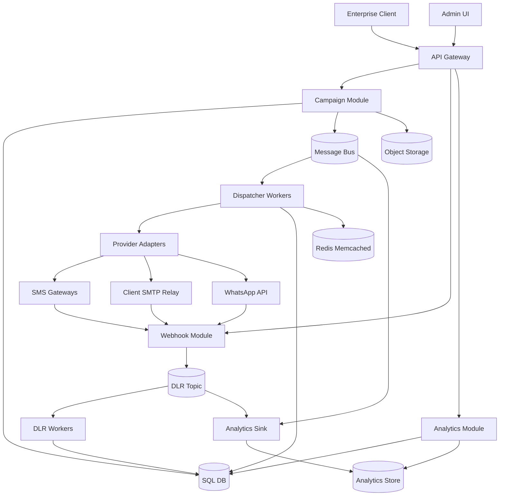
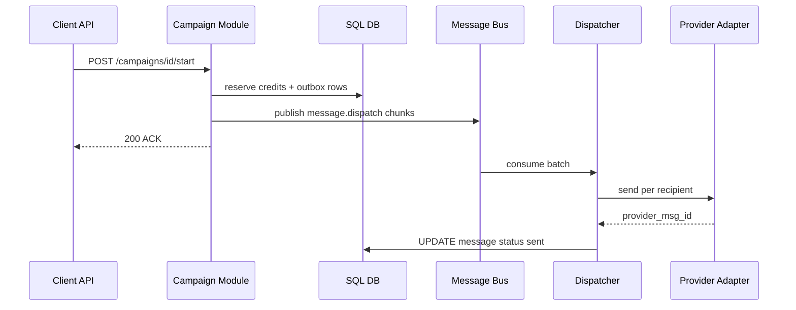
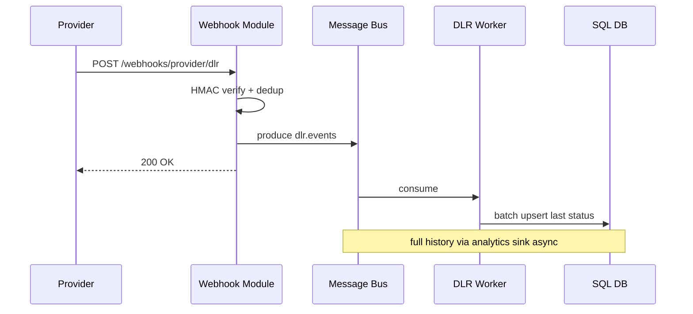

# Пример: B2B bulk messaging platform

← [FRAMEWORK.md](../FRAMEWORK.md) · [vk-social.md](vk-social.md) · [nutrition-mobile-app.md](nutrition-mobile-app.md) · [paypal-payments.md](paypal-payments.md)

**Overview:** одна кампания → миллионы получателей → bus dispatch → SMS / WhatsApp / **client SMTP** → DLR → analytics

*Мультиканальная B2B-платформа **массовых рассылок** (SMS, email, WhatsApp, мессенджеры) для enterprise-клиентов.*

---

## 1. FR (5–8 min)

| ID | Требование | Пояснение |
|----|------------|-----------|
| **FR-1** | **Массовая рассылка:** кампания → audience + channel + template + schedule | Sync ACK `campaign_id`; **одна кампания — до 10M получателей**; suppression check до enqueue |
| **FR-2** | Персонализация шаблона per recipient | `{{vars}}`, rules; resolve до dispatch |
| **FR-3** | Multi-channel dispatch: SMS / **email** / WhatsApp / др. | **Async** fan-out после ACK; provider Strategy + fallback; email → **SMTP профиль клиента** |
| **FR-4** | DLR: delivered / failed / read | Webhook **idempotent** по `provider_msg_id`; status async |
| **FR-5** | Статус кампании + отчёт | PG live counters + analytics store historical |
| **FR-6** | Prepaid credits: reserve → debit | **Atomic**; no negative balance; refund on permanent fail — pull |

**В заметках:** FR-7 Auth/API keys B2B · FR-8 Rate limits per client/channel · FR-9 Audience CSV presigned upload · FR-10 **Dedicated SMTP:** клиент регистрирует свой SMTP (host, creds, From-domain); platform relay без смешивания с другими клиентами

**UC → FR:** UC1 Создать **массовую** кампанию → FR-1, FR-2 · UC2 **Запустить рассылку** на audience → FR-3, FR-6 · UC3 Получить DLR → FR-4 · UC4 Dashboard → FR-5 · UC5 Fallback канал → FR-3 · UC6 *(Should)* Email через **свой SMTP** → FR-3, FR-10

**Акторы:** Enterprise Client · Admin UI · Client API · Campaign Service · Dispatcher · Provider Adapters · Webhook Gateway · DLR Processor · Analytics

**Интеграции:**

| Система | Зачем | Sync/Async | FR |
|---------|-------|------------|-----|
| SMS aggregators | outbound SMS | async dispatch | FR-3 |
| **Client SMTP** | email mass send от домена клиента | async via relay pool | FR-3, FR-10 |
| WhatsApp Business API | outbound messages | async dispatch | FR-3 |
| Message bus | dispatch + DLR buffer | async | FR-3, FR-4 |
| Analytics store | campaign funnel, reports | async ingest, sync read | FR-5 |

**Out of scope:** ML routing, full CRM, OTP transactional product, **full compliance gateway** (STOP/regulatory — pull §4.1), content moderation ML

**ER:** Client 1──M Campaign · Client 1──M **SmtpProfile** · Campaign 1──M Message · Campaign M──1 Template · Message 1──M DeliveryAttempt · Client 1──1 CreditBalance

---

## 2. NFR (5–7 min)

### 2.1 Цифры на доску

**Допущения:** ~1B msg/day · ~200 B2B clients · avg **~11.6K/s** · peak **~500K/s** = *3 mega-campaigns × 5M recipients in 30s overlap* · ~500 B/event

| Вопрос | Формула / допущение | Результат | На доске |
|--------|---------------------|-----------|----------|
| Avg outbound/s | 1B ÷ 86_400 | **~11.6K/s** | ~12K/s avg |
| Peak outbound/s | 3 × 5M ÷ 30s | **~500K/s** | **500K/s peak** |
| DLR ingest peak | ~1:1 sends | **~500K/s** | 500K/s DLR |
| Message bus volume/day | 1B × ~500 B | **~500 GB/day** | ~500 GB/day |
| PG status writes peak | batched 1K rows | **~500K rows/s** | batched writes |
| POST /campaigns p99 | API + SQL ~2× SSD | **≤ 500 ms** | p99 ≤ 500 ms |
| DLR ACK p99 sync | HMAC + dedup + produce ~13 ms p50 | **≤ 50 ms** | ACK ≤ 50 ms |
| Platform uptime | product | **99.95%** | 99.95% |
| Credits RPO | CP invariant | **≈ 0** | RPO ≈ 0 |

**Драйвер:** FR-3 + FR-4 — **dispatch throughput + DLR flood** at 500K/s peak.

### 2.2 Pillars + вывод

| ID | Pillar | Что спросят | На доске | типично для |
|----|--------|-------------|----------|-------------|
| O1 | Availability | multi-AZ, repl HA | ✅ | — |
| O2 | Continuity | — | — | — |
| O3 | DR | warm tier | ✅ | messaging |
| S1 | Scalability | 500K/s peak, partitions | **TOP-3** | messaging |
| S2 | Consistency | credits CP; DLR eventual | ✅ | messaging |
| X1 | Caching | template multi-level | ✅ | — |
| X2 | Processing | dispatch + DLR pipeline | **TOP-3** | messaging |
| X3 | Observability | SLO + lag alerts | ✅ | — |
| X4 | Security | webhook HMAC, API keys | ✅ | webhooks |
| X5 | Distributed TX | outbox, DLR dedup, credits | **TOP-3** | messaging |

**Вывод:** peak dispatch 500K/s + DLR flood → **§4.3** · **TOP-3:** X2 · S1 · X5

---

## 3. HLD (12–15 min)

### 3.1 API

| Endpoint | Зачем | Sync/Async |
|----------|-------|------------|
| `POST /v1/campaigns` | create + schedule | sync ACK |
| `POST /v1/campaigns/{id}/start` | enqueue recipients | sync ACK, async dispatch |
| `GET /v1/campaigns/{id}/stats` | live + aggregate | sync |
| `POST /v1/webhooks/{provider}/dlr` | delivery receipt | sync 200, async process |
| `GET /v1/templates` | template catalog | sync |

**NestJS modules (роли):** Campaign · Dispatch · Provider · Webhook · Analytics

### 3.2 Data

```
Client · Campaign · Message · Template · DeliveryAttempt · CreditBalance · Outbox  *(ER — §1)*
Store roles: SQL DB (OLTP) · Message bus (dispatch + DLR) · Analytics store (funnel) · Cache · Object storage (audience CSV)
```

**Ключевые constraints:** `UNIQUE(provider, external_msg_id)` · outbox table · `messages` partitioned by month

### 3.3 HLD — схема системы



**UC2: Start campaign (data flow):**



**UC3: DLR webhook (data flow):**



---

## 4. Deep Dive (15–18 min) · образец прохода

*Интервьюер выберет **1–2 темы** — обычно dispatch + DLR pipeline. Не проходить все §4 подряд.*

**Типичный сценарий:** §4.3 · §4.2 — **если спросят admin/API latency**

### §4.3 Async pipelines *(образец — единственный блок на доске)*

**Dispatch + DLR (ядро):**

| Вопрос | Trade-off | Решение |
|--------|-----------|---------|
| Sync API vs 500K/s? | client waits vs throughput | **message bus** `message.dispatch` after sync ACK |
| Partition key? | campaign locality vs parallelism | **`hash(recipient)`** — per-recipient order |
| Peak 500K/s? | single consumer vs scale | 512–1024 partitions · groups per channel · HPA on lag |
| Campaign enqueue? | lost events vs latency | **outbox** PG → bus |
| DLR flood? | provider timeout vs DB melt | fast **200** → bus → **batch upsert** 500–1000 rows |
| PG write pressure? | full history vs OLTP | **last status** in PG; **full DLR history** → analytics store |
| DLR idempotency? | duplicate webhooks | `UNIQUE(provider, external_msg_id)` |
| Credits? | double debit | reserve on start · debit on send · idempotent worker — **X5** |

**Failure modes:**

| Сбой | Поведение |
|------|-----------|
| Duplicate DLR | 200 OK; no double status / credit debit |
| Provider timeout | retry → fallback chain → mark failed |
| Consumer lag | HPA scale; alert `dispatcher_lag_seconds` |
| Analytics sink lag | reports stale; PG live counters still OK |
| Worker crash mid-batch | at-least-once; idempotent upsert |

**Pull (если спросят):** message bus vs NATS — retention, replay · Connect vs custom ETL → analytics store · provider cascade chain · **dedicated SMTP per client** (pool isolation, SPF/DKIM on client side) · §4.1 compliance gateway (STOP, suppression)

### §4.2 Template cache *(второй блок — если спросят latency, X1)*

| Вопрос | ✅ |
|--------|-----|
| L1 local | compiled template AST per dispatcher worker |
| Memcached | hot templates by `template_id` |
| Redis | segment metadata, rate limit counters |
| Invalidation | on `template.published` event — delete prefix |

### Infra sizing *(pull, ~2 min)*

| Компонент | Тех | Размер | Откуда |
|-----------|-----|--------|--------|
| Message bus | Kafka cluster | 20–50 brokers, ~1K partitions | §2.1 peak |
| Dispatcher | K8s HPA | scale on `dispatcher_lag_seconds` | 500K/s |
| SQL DB | PostgreSQL partitioned | messages by month, 90d hot | §2.1 |
| Analytics store | ClickHouse 3-node | TTL 2y funnel | §2.1 |
| Cache | Redis + Memcached | templates + rate limits | FR-2, FR-8 |

---

← [FRAMEWORK.md](../FRAMEWORK.md)
