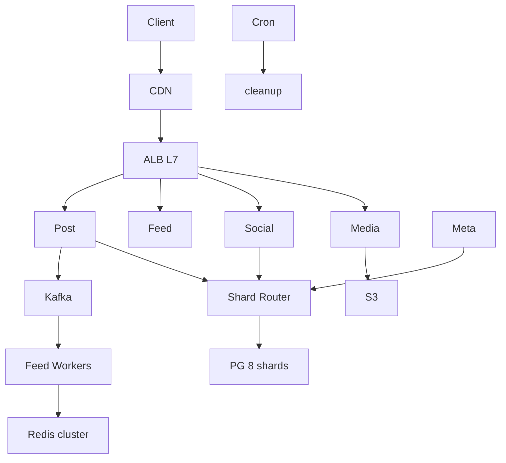
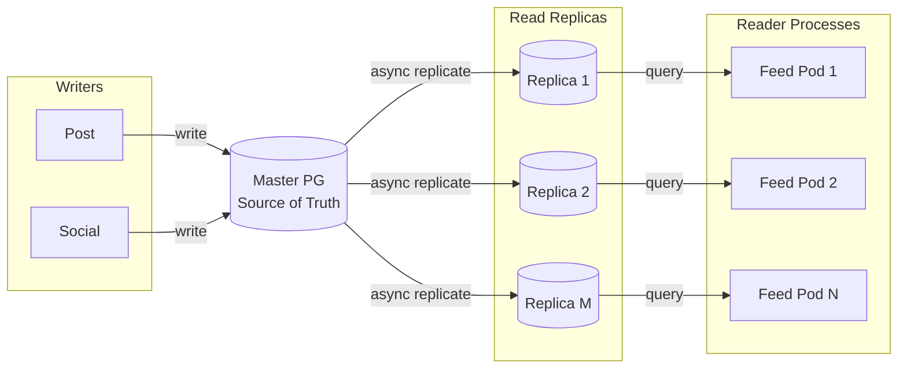
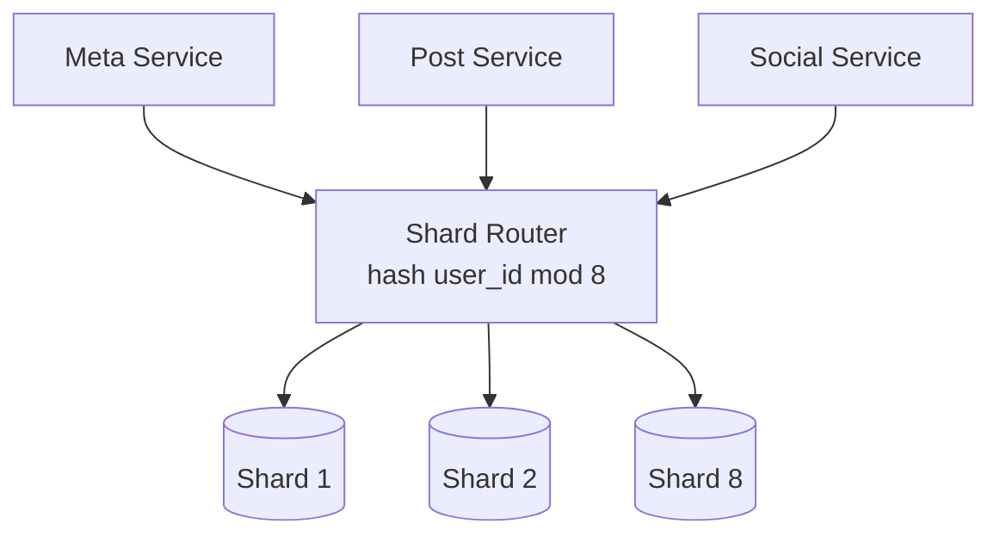
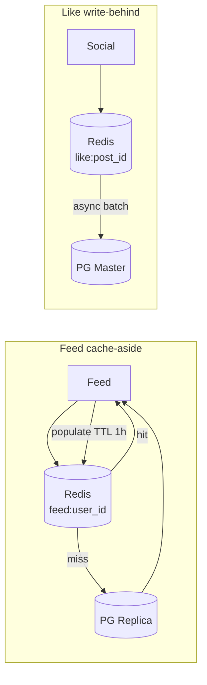
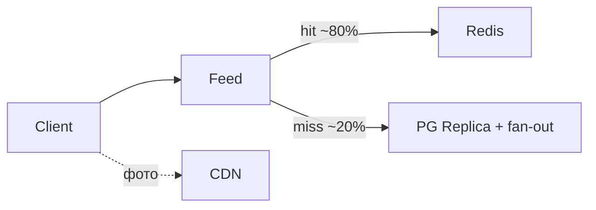

# Пример: Instagram-like feed

← [FRAMEWORK.md](../FRAMEWORK.md)

**50M users · без geo · latency пост/лента ≤ 2s · 1 пост / 5 дней · лента 5×/день · 10 постов · ~700 KB/пост**

---

## 1. FR

| UC | Функция |
|----|---------|
| UC1 | Загрузка поста (текст ~100 симв. + 1 фото) |
| UC2 | Лента — обратный хронологический порядок |
| UC3 | Лайки, комментарии |
| UC4 | Подписка / отписка |

`User 1──M Post · User M──N User · Post 1──M Like, Comment`

---

## 2. NFR + trade-offs

### Расчёты

```
Write RPS = 50M ÷ 5 ÷ 86_400 ≈ 115        Read RPS = 50M × 5 ÷ 86_400 ≈ 2_900
Write     = 115 × 700 KB ≈ 80 MB/s        Read     = 2_900 × 700 KB × 10 ≈ 20 GB/s
Storage   = 80 MB/s × 86_400 × 365 ≈ 2.5 TB/год
```

| Блок | ✅ Выбор |
|------|----------|
| **Performance** | p99 ≤ 2s · read bottleneck — **CDN** на 20 GB/s media ([CDN](../trade-offs/architecture/cdn-object-storage-pattern.md)) |
| Scalability | hash-shard PG 8× · async replicas · Redis feed cache ([sharding](../trade-offs/data/sharding-partitioning.md) · [cache](../trade-offs/architecture/caching-patterns.md)) |
| Consistency | AP лента · CP профиль/подписки ([CAP](../trade-offs/architecture/cap-pacelc-distributed.md)) |
| Reliability | SLA 99.9% · async fan-out через Kafka ([resilience](../trade-offs/architecture/resilience-backpressure.md)) |
| Observability | p99 feed, CDN hit rate, Kafka lag ([observability](../trade-offs/architecture/observability-architecture.md)) |
| Processing | fan-out async · Cron — cleanup stale feed ([batch/stream](../trade-offs/architecture/batch-vs-stream.md)) |
| Security | JWT · rate limit на gateway ([gateway](../trade-offs/technologies/api-gateways.md)) |

### Infra

| Компонент | Тех | Размер |
|-----------|-----|--------|
| CDN | Cloudflare | ~20 GB/s peak |
| S3 | Standard | ~2.5 TB/год |
| Kafka | 3 brokers | fan-out от 115 w/s |
| Redis | cluster 6 nodes | feed lists · like counters hot keys |
| PG | 1 primary + 3 replica · **8 shards** | metadata · posts/follows by `user_id` |
| K8s | API + workers | ~3K read RPS |

---

## 3. API

| Вызов | UC | Заметка |
|-------|-----|---------|
| `write_post(params)` | UC1 | sync · [idempotency](../trade-offs/api/write-api-idempotency.md) |
| `upload_image(image)` | UC1 | presigned S3 |
| `get_feed(user_id, offset)` | UC2 | [offset→cursor](../trade-offs/data/pagination-cursor-offset.md) · [push/pull](../trade-offs/api/push-vs-pull-delivery.md) |
| `subscription(user_id, type)` | UC4 | follow / unfollow |

Протокол: **REST** к клиенту ([rest-grpc-graphql](../trade-offs/api/rest-grpc-graphql.md)) · publish поста → **async** Kafka ([sync-async](../trade-offs/api/sync-async-messaging.md))

---

## 4. Data

**PG** — users, posts, follows, likes · **Redis** `feed:{user_id}` · **S3** — фото

| Тема | ✅ |
|------|-----|
| SQL для графа и транзакций ([sql-nosql](../trade-offs/data/sql-vs-nosql-paradigm.md)) | PostgreSQL |
| Денорм feed list в Redis ([norm-denorm](../trade-offs/data/normalization-denormalization.md)) | да |
| Индекс `(user_id, created_at)` под ленту ([indexing](../trade-offs/data/indexing-strategy.md)) | да |

### Trade-offs → выбор (data layer)

| Тема | A / B | ✅ Выбор | Почему |
|------|-------|----------|--------|
| Топология ([master-slave](../trade-offs/data/master-slave-multi-master.md)) | master-slave / multi-master | **master-slave** | один writer, 115 w/s — conflict resolution не нужен |
| Репликация ([replication](../trade-offs/data/replication-sync-async.md)) | sync / async | **async** | RPO секунды OK · p99 write ≤ 2s · лента eventual |
| Шардирование ([sharding](../trade-offs/data/sharding-partitioning.md)) | range / hash / geo | **hash(`user_id`) mod 8** | равномерно · нет geo · range даст hotspot на новых user |
| Кэш ленты ([cache](../trade-offs/architecture/caching-patterns.md)) | aside / through / back | **cache-aside** | hot 20% users = 80% reads · miss → PG+fan-out |
| Кэш лайков | aside / through / back | **write-behind** | burst лайков · eventual OK · batch flush в PG |

---

## 5. HLD

**4 сервиса** ([monolith-micro](../trade-offs/architecture/monolith-microservices.md)) · stateless API ([stateless](../trade-offs/architecture/stateless-stateful.md))

### Общая схема



### Репликация — master + read replicas



follows / profile → **primary** · feed timeline → **replica** (stale ≤ replication lag)

### Шардирование — hash by user_id



posts / follows / likes — shard key = `user_id` · cross-shard JOIN нет · celebrity fan-out через Kafka, не scatter-gather

### Кэширование — cache-aside лента + write-behind лайки



### UC2 лента



фото с CDN, не origin.

**Сбой:** Kafka lag → лента stale; CDN down → fallback signed S3 (медленнее); replica lag → read-after-write miss на своём посте → fallback primary.

---

← [FRAMEWORK.md](../FRAMEWORK.md)
