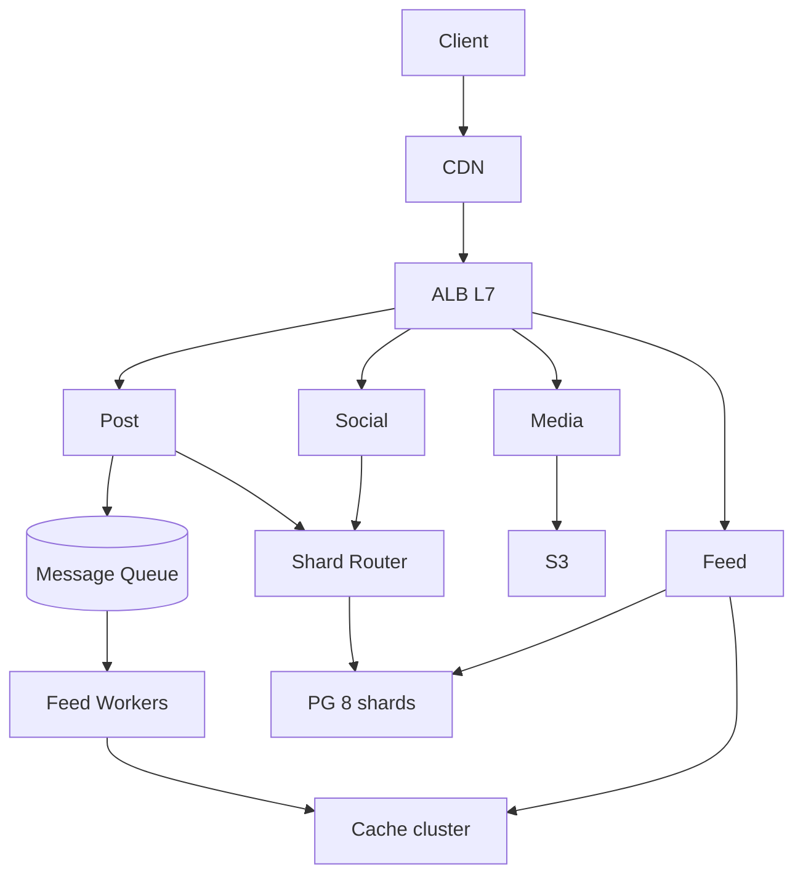
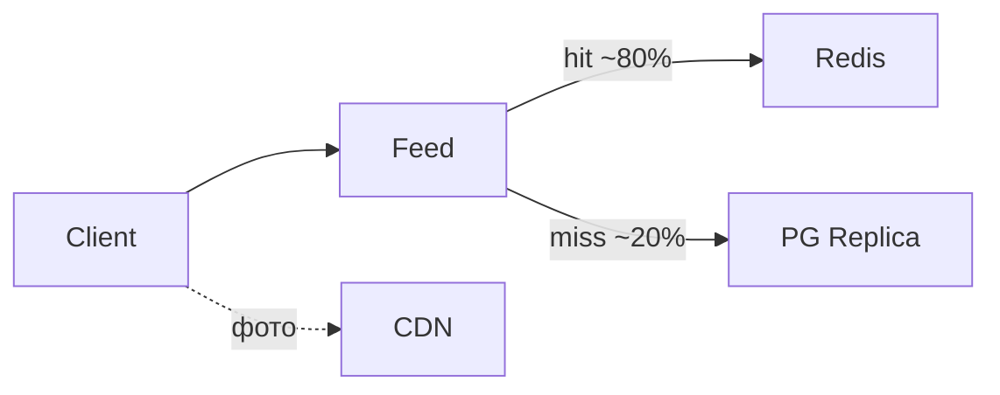

# Пример: Instagram-like feed

← [FRAMEWORK.md](../FRAMEWORK.md) · [instagram-feed.md](instagram-feed.md)

**Overview:** post → async fan-out → feed cache

---

## 1. FR (5–8 min)

| ID | Требование | Пояснение |
|----|------------|-----------|
| **FR-1** | User загружает пост (текст + 1 фото) | Sync ACK metadata; media — presigned upload |
| **FR-2** | Лента подписок — reverse chrono | Pagination; stale OK (секунды) |
| **FR-3** | Like/unlike **идемпотентен** | Повторный click — тот же результат |
| **FR-4** | Follow/unfollow — strong consistency | Unfollow сразу убирает из ленты |
| **FR-5** | Celebrity fan-out async | N followers — не sync в POST |
| **FR-6** | Read >> write на ленте | Hot read path; write — fan-out |

**UC → FR:** UC1 Загрузить пост → FR-1 · UC2 Открыть ленту → FR-2, FR-6 · UC3 Like → FR-3 · UC4 Follow → FR-4 · UC5 Celebrity публикует → FR-5

**Акторы:** User · Mobile Client · Post API · Feed API · Media Service

**Интеграции:** Object storage — media upload (FR-1)

**Out of scope:** DMs, search, geo feed, video transcode

**ER:** User 1──M Post · User M──N User · Post 1──M Like

---

## 2. NFR (5–7 min)

### 2.1 Цифры на доску

**Допущения:** 50M users · single region · 1 пост / 5 дней · лента 5×/день · ~700 KB/пост

| Вопрос | Формула / допущение | Результат | На доске |
|--------|---------------------|-----------|----------|
| Users | — | **50M** | 50M |
| Write QPS | 50M ÷ 5 ÷ 86_400 | **~115** | ~115 w/s |
| Read QPS | 50M × 5 ÷ 86_400 | **~2_900** | ~2.9K r/s |
| Read:Write | | **~25 : 1** | 25:1 |
| Bandwidth read | 2_900 × 10 × 700 KB | **~20 GB/s** | ~20 GB/s |
| Storage / year | 80 MB/s × 86_400 × 365 | **~2.5 TB** | ~2.5 TB/yr |
| Peak read | avg × burst ×5 prime time | **~14.5K r/s** | burst ×5 |
| GET feed p99 | CDN edge + 2× SSD ~1 ms | **≤ 2 s** | p99 ≤ 2 s |
| SLA uptime | product | **99.9%** | 99.9% |
| RPO / RTO | stale feed OK | сек · **< 15 min** | RPO сек · RTO 15m |

**Драйвер:** FR-6 — read bandwidth доминирует.

### 2.2 Pillars + вывод

| ID | Pillar | Что спросят | На доске | типично для |
|----|--------|-------------|----------|-------------|
| O1 | Availability | async repl — HA | ✅ | — |
| O2 | Continuity | — | — | — |
| O3 | DR | warm tier | ✅ | write-heavy |
| S1 | Scalability | read path 20 GB/s | **TOP-3** | read-heavy |
| S2 | Consistency | strong follow / eventual feed | ✅ | read-heavy |
| X1 | Caching | edge + app cache | **TOP-3** | read-heavy |
| X2 | Processing | async fan-out | **TOP-3** | read-heavy |
| X3 | Observability | SLO metrics | ✅ | — |
| X4 | Security | — | — | — |
| X5 | Distributed TX | — | — | CP/money |

**Вывод:** read bandwidth ~20 GB/s → **§4.2** · **TOP-3:** X1 · S1 · X2

---

## 3. HLD (12–15 min)

### 3.1 API

| Endpoint | Зачем | Sync/Async |
|----------|-------|------------|
| `POST /posts` | upload metadata | sync ACK |
| `GET /feed` | лента подписок | sync |
| `POST /follow` | graph edge | sync |

### 3.2 Data

```
User 1──M Post · User M──N User · Post 1──M Like  *(ER — §1)*
Store roles: SQL DB (graph) · Object storage (media) · Cache (feed denorm)
```

### 3.3 HLD — схема системы



**UC2 лента (data flow):**



---

## 4. Deep Dive (15–18 min) · образец прохода

*Интервьюер выберет **1–2 темы** — обычно bottleneck из вывода §2.2. Ниже образец, если повели в §4.2.*

**Типичный сценарий:** §4.2 → по вопросу §4.3 (X2) · §4.4 — только если спросят

### §4.2 DB + Cache *(образец — единственный блок на доске)*

| Вопрос | ✅ |
|--------|-----|
| SQL vs NoSQL | PostgreSQL — graph + transactions |
| Read hot path | Redis cache-aside feed lists |
| Media bandwidth | CloudFront + S3 |
| HA | async repl — **HA**, stale feed OK |

**Pull (если спросят):** fan-out queue pub/sub (X2) · failures: cache down → DB replica, CDN miss → rate limit · infra sizing — таблица ниже

### Infra sizing *(pull, ~2 min)*

| Компонент | Тех | Размер | Откуда |
|-----------|-----|--------|--------|
| CDN | Cloudflare | ~20 GB/s peak | §2.1 bandwidth |
| Cache | Redis cluster | feed + likes | read-heavy |
| DB | PG 8 shards + 3 repl | metadata | §2.1 storage |
| API | K8s | ~3K r/s | §2.1 read QPS × headroom |
| Broker | Kafka ×3 | fan-out | §2.1 write QPS |

← [FRAMEWORK.md](../FRAMEWORK.md)
