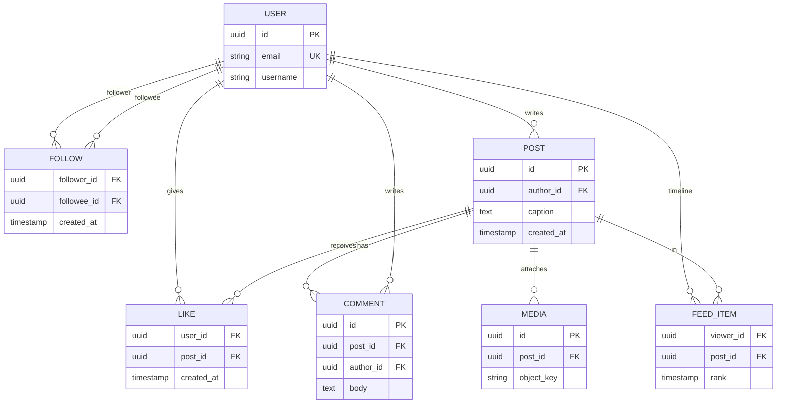
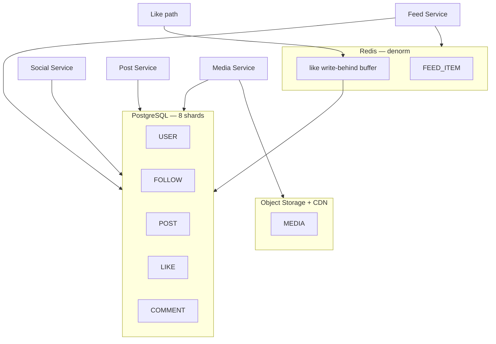
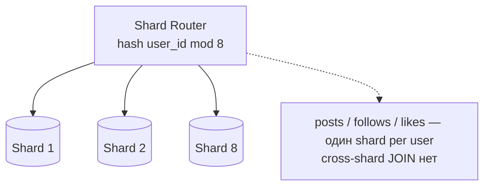
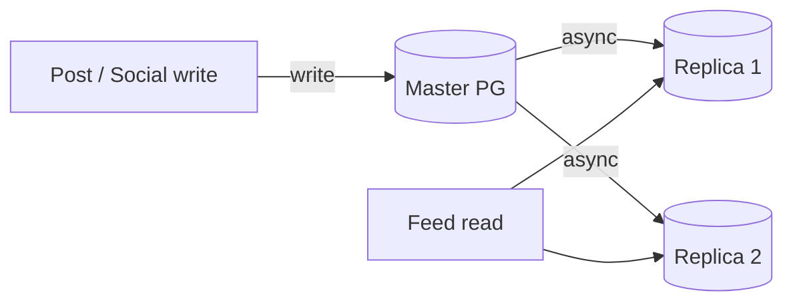
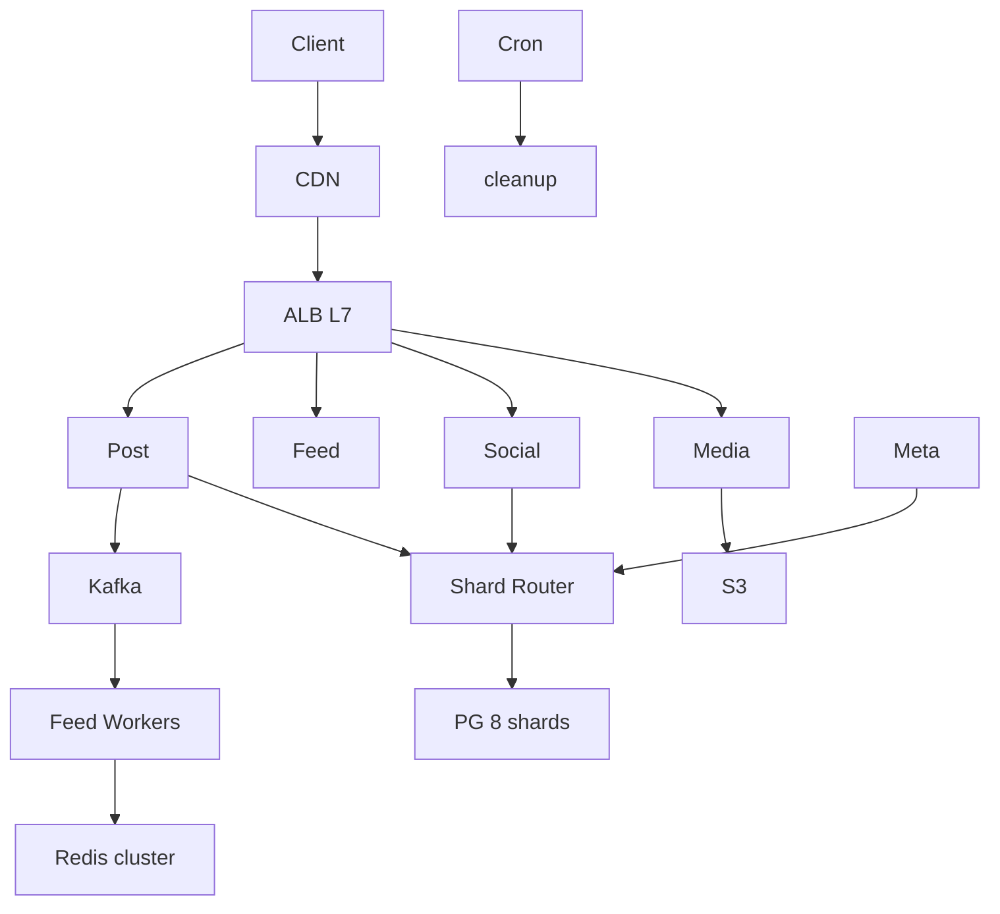
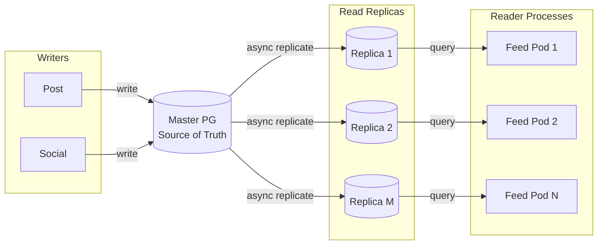
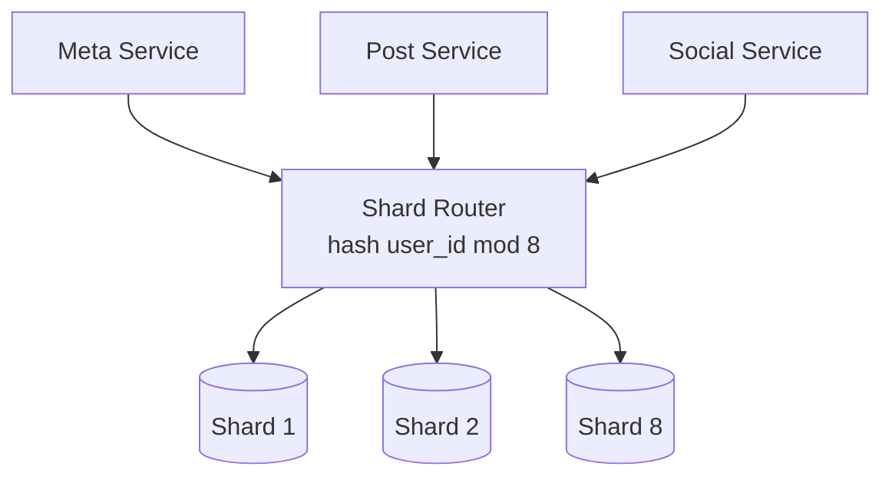
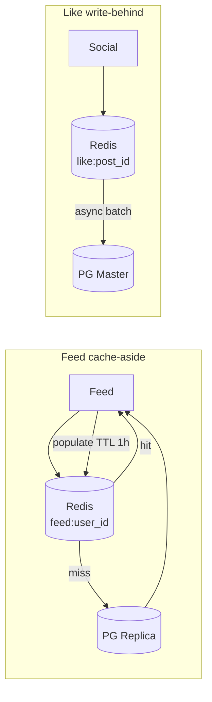
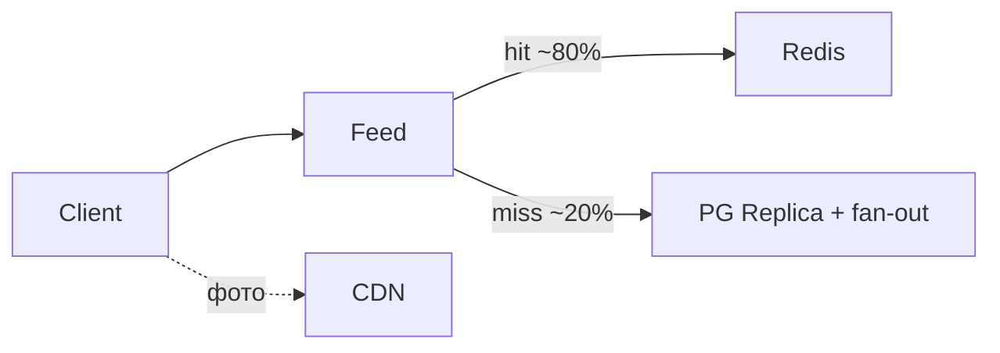

# Пример: Instagram-like feed

← [FRAMEWORK.md](../FRAMEWORK.md)

**50M users · без geo · latency пост/лента ≤ 2s · 1 пост / 5 дней · лента 5×/день · 10 постов · ~700 KB/пост**

---

## 1. FR

| UC | Функция |
|----|---------|
| UC1 | Загрузка поста (текст ~100 симв. + 1 фото) |
| UC2 | Лента — обратный хронологический порядок |
| UC3 | Лайки, комментарии |
| UC4 | Подписка / отписка |

`User 1──M Post · User M──N User · Post 1──M Like, Comment`

---

## 2. NFR

### 2.1 Входные допущения

| Параметр | Значение |
|----------|----------|
| Users | 50M |
| Posts | 1 / 5 дней / user |
| Feed reads | 5×/день, 10 постов в ответе |
| Media/post | ~700 KB (фото) |
| Geo | нет |

### 2.2 Capacity

| Метрика | Формула | Результат |
|---------|---------|-----------|
| Write RPS | 50M ÷ 5 ÷ 86_400 | **~115** |
| Read RPS | 50M × 5 ÷ 86_400 | **~2_900** |
| Write bandwidth | 115 × 700 KB | **~80 MB/s** |
| Read bandwidth (media) | 2_900 × 10 × 700 KB | **~20 GB/s** ← bottleneck |
| Storage/год | 80 MB/s × 86_400 × 365 | **~2.5 TB** |

**Вывод:** read bandwidth >> write → edge cache обязателен (§6).

### 2.3 CAP / Consistency

| Участок | Требование |
|---------|------------|
| UC2 лента | eventual OK |
| профиль / follow | strong |

→ [CAP](../trade-offs/architecture/cap-pacelc-distributed.md)

### 2.4 Latency

#### A. Sync — клиент ждёт

| UC | p99 SLO |
|----|---------|
| UC1 post | ≤ 2s |
| UC2 feed | ≤ 2s |

#### B. Async — клиент не ждёт

| Процесс | SLO |
|---------|-----|
| fan-out ленты подписчикам | секунды OK |

### 2.5 Throughput

Peak ~115 w/s write · ~2_900 r/s read · burst ×5 на feed в prime time.

### 2.6 Availability

| Параметр | Значение |
|----------|----------|
| SLA | 99.9% |
| RPO ленты | секунды (stale feed OK) |

### 2.7 Observability

| Signal | Зачем |
|--------|-------|
| p99 feed | latency SLO |
| fan-out lag | stale feed |
| cache hit rate | CDN / feed cache |

---

## 3. API

| Вызов | UC | Заметка |
|-------|-----|---------|
| `write_post(params)` | UC1 | sync · [idempotency](../trade-offs/api/write-api-idempotency.md) |
| `upload_image(image)` | UC1 | presigned S3 |
| `get_feed(user_id, offset)` | UC2 | [offset→cursor](../trade-offs/data/pagination-cursor-offset.md) · [push/pull](../trade-offs/api/push-vs-pull-delivery.md) |
| `subscription(user_id, type)` | UC4 | follow / unfollow |

Протокол: **REST** к клиенту ([rest-grpc-graphql](../trade-offs/api/rest-grpc-graphql.md)) · publish поста → **async event** ([sync-async](../trade-offs/api/sync-async-messaging.md))

---

## 4. Data

**PostgreSQL** — users, posts, follows, likes · **cache** — feed lists · **object store** — фото

### ER — core entities

`FOLLOW` — M:N · `FEED_ITEM` — denorm для Redis (UC2) · `LIKE` — composite PK `(user_id, post_id)`

### Размещение по store

metadata в PG · фото blob в S3 · лента hot users в Redis

### Шардирование — hash by user_id

shard key = `user_id` · celebrity fan-out через Kafka, не scatter-gather → [sharding](../trade-offs/data/sharding-partitioning.md)

### Репликация — master + read replicas

follows / profile → **primary** · feed timeline → **replica** (stale ≤ replication lag)

| Тема | ✅ |
|------|-----|
| SQL для графа и транзакций ([sql-nosql](../trade-offs/data/sql-vs-nosql-paradigm.md)) | PostgreSQL |
| Денорм feed list в Redis ([norm-denorm](../trade-offs/data/normalization-denormalization.md)) | да |

### Indexing trade-offs → выбор

| Запрос (FR) | NFR | Алгоритм | Форма | Механика | ✅ |
|-------------|-----|----------|-------|----------|-----|
| UC2 лента `WHERE user_id=? ORDER BY created_at DESC` | read 20:1 · p99 ≤ 2s | B-Tree | composite `(user_id, created_at DESC)` | sorted leaves → ORDER BY без sort step | да |
| UC3 like by `post_id` | burst writes | B-Tree | single `(post_id)` | point lookup по FK | да |
| UC1 login по email | rare lookup | B-Tree | UNIQUE `(email)` | equality на unique key | да |
| keyword по caption | out of scope MVP | GIN | tsvector | posting list по токенам | нет |
| semantic «похожие посты» | deferred UC | Vector | HNSW | ANN по embedding, не keyword | нет |

→ цепочка: [indexing](../trade-offs/data/indexing-strategy.md)

### Trade-offs → выбор (data layer)

| Тема | A / B | ✅ Выбор | Почему |
|------|-------|----------|--------|
| Топология ([master-slave](../trade-offs/data/master-slave-multi-master.md)) | master-slave / multi-master | **master-slave** | один writer, 115 w/s — conflict resolution не нужен |
| Репликация ([replication](../trade-offs/data/replication-sync-async.md)) | sync / async | **async** | RPO секунды OK · p99 write ≤ 2s · лента eventual |
| Шардирование ([sharding](../trade-offs/data/sharding-partitioning.md)) | range / hash / geo | **hash(`user_id`) mod 8** | равномерно · нет geo · range даст hotspot на новых user |
| Кэш ленты ([cache](../trade-offs/architecture/caching-patterns.md)) | aside / through / back | **cache-aside** | hot 20% users = 80% reads · miss → PG+fan-out |
| Кэш лайков | aside / through / back | **write-behind** | burst лайков · eventual OK · batch flush в PG |

---

## 5. HLD

**4 сервиса** ([monolith-micro](../trade-offs/architecture/monolith-microservices.md)) · stateless API ([stateless](../trade-offs/architecture/stateless-stateful.md))

### Общая схема

### Репликация — master + read replicas

follows / profile → **primary** · feed timeline → **replica** (stale ≤ replication lag)

### Шардирование — hash by user_id

posts / follows / likes — shard key = `user_id` · cross-shard JOIN нет · celebrity fan-out через Kafka, не scatter-gather

### Кэширование — cache-aside лента + write-behind лайки

### UC2 лента

фото с CDN, не origin.

**Сбой:** broker lag → лента stale; CDN down → fallback signed origin (медленнее); replica lag → read-after-write miss на своём посте → fallback primary.

---

## 6. Technology choices

### Broker (post → fan-out)

| Вопрос | Если да | Если нет |
|--------|---------|----------|
| N consumers на одно событие? | log / pub-sub | point-to-point queue |
| Replay / retention нужен? | Kafka | Redis queue / BullMQ |
| **✅ Выбор** | **Kafka** | 115 w/s fan-out, replay при lag |

→ [messaging](../trade-offs/architecture/messaging-patterns.md) · [brokers](../trade-offs/technologies/message-brokers.md)

### Cache (feed)

| Вопрос | Если да | Если нет |
|--------|---------|----------|
| Read >> write? | cache-aside | без cache |
| Stale ленты OK? | in-memory list | read PG каждый раз |
| **✅ Выбор** | **Redis cache-aside** | hot ~20% users = ~80% reads |

→ [cache](../trade-offs/architecture/caching-patterns.md)

### Media + CDN

| Вопрос | Выбор |
|--------|-------|
| Read media ~20 GB/s из §2.2 | CDN + object storage origin |

→ [CDN](../trade-offs/architecture/cdn-object-storage-pattern.md)

### DB

| Вопрос | Выбор |
|--------|-------|
| OLTP + joins + graph follows | PostgreSQL |
| Scale metadata writes | 8 shards `hash(user_id)` |
| Read scale feed | 3 async replicas |

→ [sharding](../trade-offs/data/sharding-partitioning.md) · [replication](../trade-offs/data/replication-sync-async.md)

### Infra

| Компонент | Тех | Размер | Откуда |
|-----------|-----|--------|--------|
| CDN | Cloudflare | ~20 GB/s peak | §2.2 read media |
| Object storage | S3 | ~2.5 TB/год | §2.2 storage |
| Broker | Kafka, 3 brokers | fan-out | §2.2 write RPS |
| Cache | Redis cluster | feed + likes | §2.5 read-heavy |
| DB | PG, 8 shards + 3 replica | metadata | §2.2 |
| API | K8s | ~3K r/s | §2.5 |
| Gateway | ALB L7 | — | [gateway](../trade-offs/technologies/api-gateways.md) |

---

← [FRAMEWORK.md](../FRAMEWORK.md)
