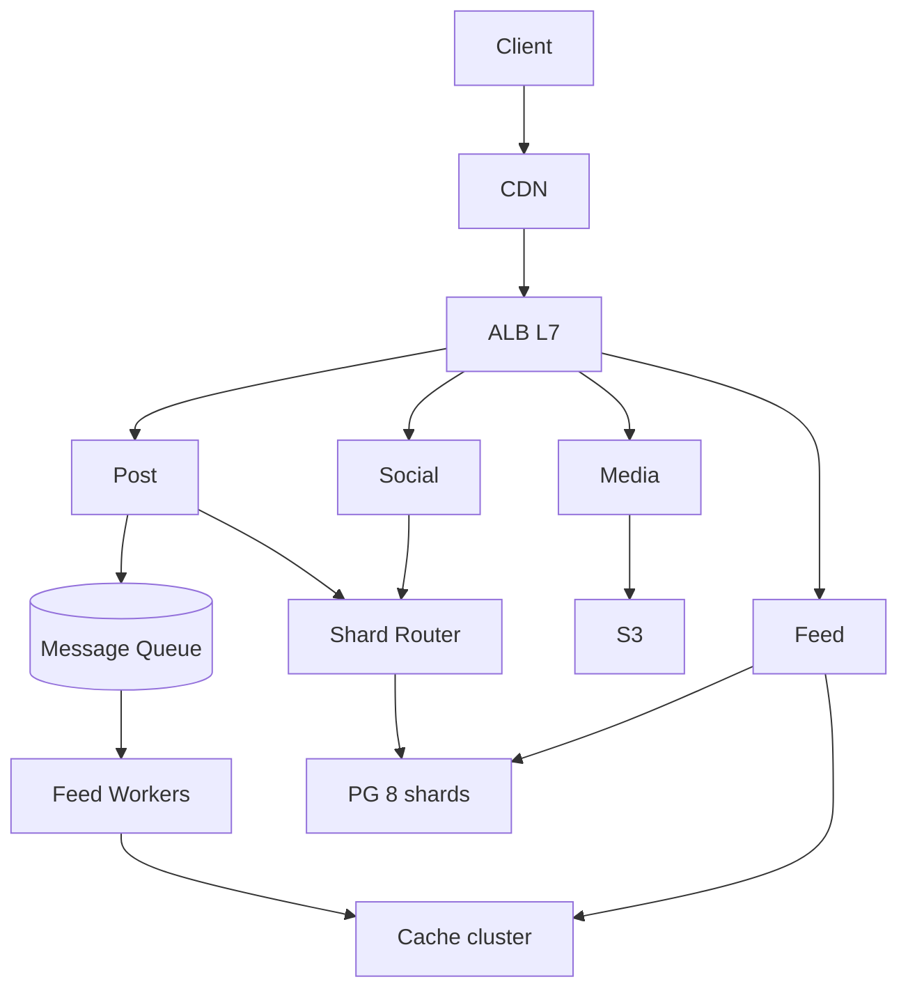
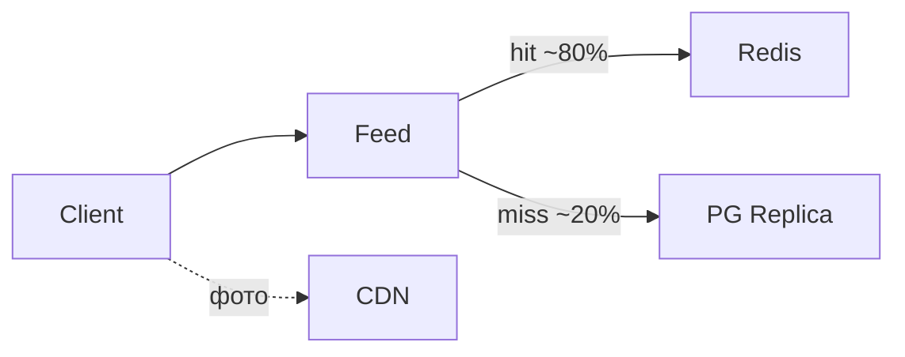

# Пример: Instagram-like feed

← [FRAMEWORK.md](../FRAMEWORK.md) · [instagram-feed.md](instagram-feed.md)

**Overview:** post → async fan-out → feed cache

---

## 1. FR (5–8 min)

| ID | Требование | Пояснение |
|----|------------|-----------|
| **FR-1** | User загружает пост (текст + 1 фото) | Sync ACK metadata; media — presigned upload |
| **FR-2** | Лента подписок — reverse chrono | Pagination; stale OK (секунды) |
| **FR-3** | Like/unlike **идемпотентен** | Повторный click — тот же результат |
| **FR-4** | Follow/unfollow — strong consistency | Unfollow сразу убирает из ленты |
| **FR-5** | Celebrity fan-out async | N followers — не sync в POST |
| **FR-6** | Read >> write на ленте | Hot read path; write — fan-out |

**UC → FR:** UC1 Загрузить пост → FR-1 · UC2 Открыть ленту → FR-2, FR-6 · UC3 Like → FR-3 · UC4 Follow → FR-4 · UC5 Celebrity публикует → FR-5

**Акторы:** User · Mobile Client · Post API · Feed API · Media Service

**Интеграции:** Object storage — media upload (FR-1)

**Out of scope:** DMs, search, geo feed, video transcode

**ER:** User 1──M Post · User M──N User · Post 1──M Like

---

## 2. NFR (5–7 min)

### 2.2 Расчёты

**Допущения:** 50M users · single region · 1 пост / 5 дней · лента 5×/день · ~700 KB/пост

| Метрика | Формула | Результат |
|---------|---------|-----------|
| Users | — | **50M** |
| Write QPS | 50M ÷ 5 ÷ 86_400 | **~115** |
| Read QPS | 50M × 5 ÷ 86_400 | **~2_900** |
| Read:Write | | **~25 : 1** |
| Bandwidth read | 2_900 × 10 × 700 KB | **~20 GB/s** |
| Storage / year | 80 MB/s × 86_400 × 365 | **~2.5 TB** |

**Драйвер:** FR-6 — read bandwidth доминирует.

### 2.3 SLA / SLO

| Метрика | Цель |
|---------|------|
| GET feed p50 / p95 / p99 | ~190 ms / ~500 ms / **≤ 2 s** |
| POST post p99 | **≤ 2 s** |
| SLA uptime | **99.9%** |
| SLO | 95% feed requests < 500 ms |
| RPO ленты | секунды (stale OK) · RTO < 15 min |

### 2.4 Throughput

Peak read ~2_900 r/s · write ~115 w/s · burst ×5 prime time · headroom ×2 на CDN.

### 2.5 Observability

| Метрика | Зачем |
|---------|-------|
| `feed_p99_latency_ms` | SLO §2.3 |
| `feed_cache_hit_rate` | cache health |
| `cdn_origin_bandwidth_mbps` | bottleneck alert |

### 2.6 Master Catalog — pillars

| ID | Pillar | ✅ / — | Направление | Почему §2.2/FR | TOP-3? |
|----|--------|--------|-------------|----------------|--------|
| O1 | Availability | ✅ | async repl — HA | SLA 99.9% | — |
| O2 | Continuity | — | — | не спрашивали | — |
| O3 | DR | ✅ | warm tier | RPO сек, RTO 15m | — |
| S1 | Scalability | ✅ | read path 20 GB/s | §2.2 bandwidth | **да** |
| S2 | Consistency | ✅ | strong follow / eventual feed | FR-4, FR-6 | — |
| X1 | Caching | ✅ | edge + app cache | read hot path | **да** |
| X2 | Processing | ✅ | async fan-out | FR-5 | **да** |
| X3 | Observability | ✅ | §2.5 metrics | SLO | — |
| X4 | Security | — | — | out of scope | — |
| X5 | Distributed TX | — | — | no money | — |

### 2.7 Processing paths + DR tier

| Path | Core UC | Когда | Механизм |
|------|---------|-------|----------|
| **Sync** | GET feed, POST follow | user ждёт ответ | API → cache / SQL DB |
| **Async** | celebrity fan-out | FR-5, N followers | queue / pub-sub |
| **Batch** | — | — | N/A |

**DR tier (O3):** Warm — RPO секунды, RTO 15 min · async repl standby.

### 2.8 Bottleneck → куда копать в §4

**Куда копать:** read bandwidth ~20 GB/s → Deep Dive **§4.2** (TOP-3: X1, S1, X2 — см. §2.6)

---

## 3. HLD (12–15 min)

### 3.1 API

| Endpoint | Зачем | Sync/Async |
|----------|-------|------------|
| `POST /posts` | upload metadata | sync ACK |
| `GET /feed` | лента подписок | sync |
| `POST /follow` | graph edge | sync |

### 3.2 Data

```
User 1──M Post · User M──N User · Post 1──M Like  *(ER — §1)*
Store roles: SQL DB (graph) · Object storage (media) · Cache (feed denorm)
```

### 3.3 HLD — схема системы



**UC2 лента (data flow):**



---

## 4. Deep Dive (15–18 min) · образец прохода

*Интервьюер выберет **1–2 темы** — обычно bottleneck из §2.8. Ниже образец, если повели в §4.2.*

**Типичный сценарий:** §4.2 → по вопросу §4.3 (X2) · §4.4 — только если спросят

### §4.2 DB + Cache *(образец — единственный блок на доске)*

| Вопрос | ✅ |
|--------|-----|
| SQL vs NoSQL | PostgreSQL — graph + transactions |
| Read hot path | Redis cache-aside feed lists |
| Media bandwidth | CloudFront + S3 |
| HA | async repl — **HA**, stale feed OK |

**Pull (если спросят):** fan-out queue pub/sub (X2) · failures: cache down → DB replica, CDN miss → rate limit · infra sizing — таблица ниже

### Infra sizing *(pull, ~2 min)*

| Компонент | Тех | Размер | Откуда |
|-----------|-----|--------|--------|
| CDN | Cloudflare | ~20 GB/s peak | §2.2 bandwidth |
| Cache | Redis cluster | feed + likes | read-heavy |
| DB | PG 8 shards + 3 repl | metadata | §2.2 storage |
| API | K8s | ~3K r/s | §2.2 read QPS × headroom |
| Broker | Kafka ×3 | fan-out | §2.2 write QPS |

← [FRAMEWORK.md](../FRAMEWORK.md)
