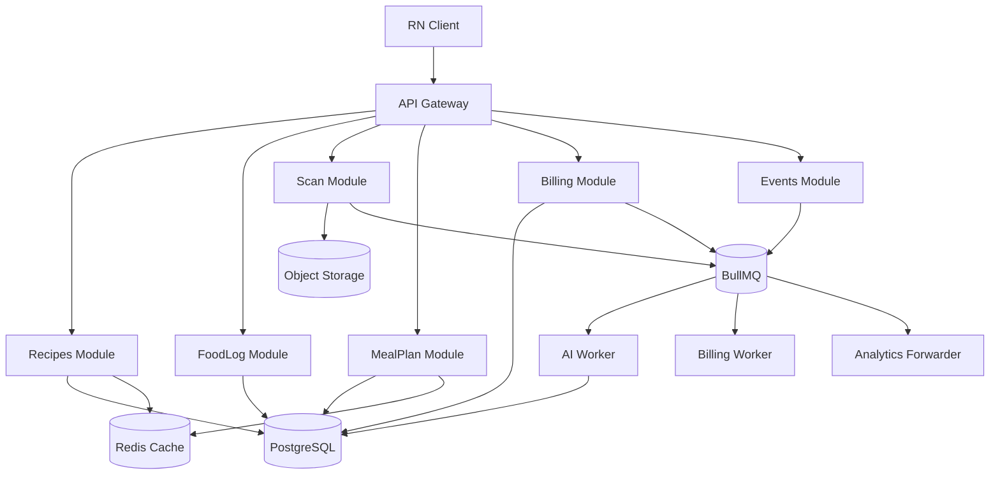
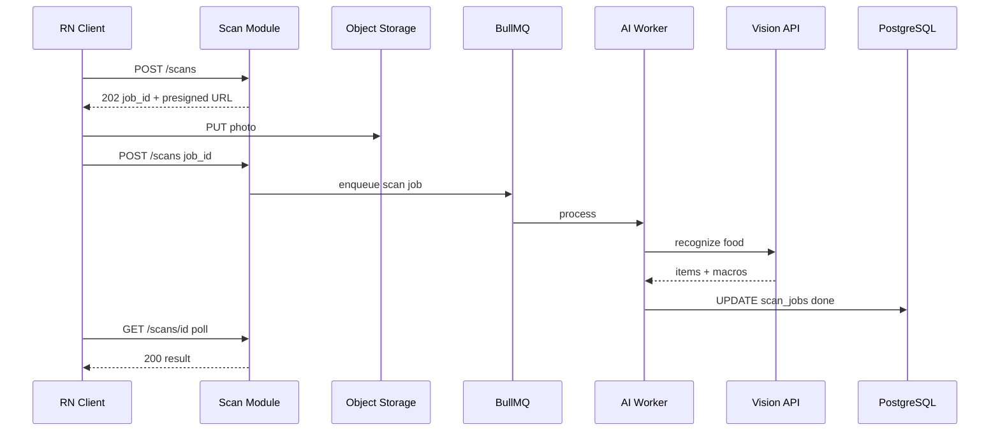
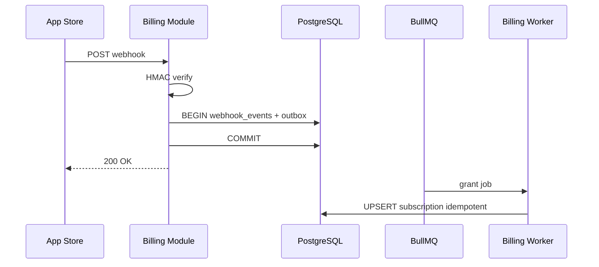

# Пример: mobile nutrition / calorie app

← [FRAMEWORK.md](../FRAMEWORK.md) · [instagram-feed.md](instagram-feed.md) · [paypal-payments.md](paypal-payments.md) · [open-world-mobile-game.md](open-world-mobile-game.md)

**Overview:** recipes catalog → food log → AI scan → meal plan · IAP billing · product events

*Мобильное приложение питания и калорий по мотивам реального продукта; без привязки к бренду.*

---

## 1. FR (5–8 min)

| ID | Требование | Пояснение |
|----|------------|-----------|
| **FR-1** | Каталог рецептов: search, фильтры (диета, аллергены), cursor pagination | Read-only catalog; stale OK минуты; admin publish invalidates cache |
| **FR-2** | Дневник: log meal вручную или из рецепта | **Idempotency-Key** на POST; дневная агрегация КБЖУ пересчитывается sync |
| **FR-3** | AI scan фото → items + КБЖУ | Presigned upload → **async job**; user poll `job_id`; fail → retry или manual edit |
| **FR-4** | Персональный meal plan: read + regenerate по целям/активности | Regenerate — async; read из mat. view / cache; plan version immutable |
| **FR-5** | Подписка IAP: webhook grant/revoke premium | **Webhook idempotent** по `transaction_id`; verify signature sync; grant async |
| **FR-6** | Client events → product analytics + A/B exposure | Fire-and-forget **202**; at-least-once; schema registry для event names |

**В заметках:** FR-7 Auth (OAuth + JWT refresh) · FR-8 Multi-currency pricing read (US/UAE/Latam) · FR-9 Feature flags / experiment assignment — sticky per user

**UC → FR:** UC1 Просмотреть каталог → FR-1 · UC2 Залогировать приём пищи → FR-2 · UC3 Сканировать еду по фото → FR-3 · UC4 Открыть план питания → FR-4 · UC5 Активировать подписку → FR-5 · UC6 Отправить product event → FR-6 · UC7 *(Should)* Experiment variant → FR-9

**Акторы:** User · RN Client · Next Admin · API Gateway · **NestJS modules** (Auth, Recipes, FoodLog, Scan, MealPlan, Billing, Events) · App Store / Play Billing · Vision/LLM API · Analytics

**Интеграции:**

| Система | Зачем | Sync/Async | FR |
|---------|-------|------------|-----|
| Object storage | фото скана, recipe images | presigned upload | FR-3, FR-1 |
| App Store / Play | subscription webhooks | sync verify → async grant | FR-5 |
| Vision/LLM API | food recognition | async worker | FR-3 |
| Amplitude/Mixpanel | product events | async forward | FR-6 |

**Out of scope:** ML model training, RN UI, маркетинг-лендинг CMS, полный translate/TTS pipeline, social feed

**ER:** User 1──M FoodLog · User 1──1 MealPlan · User 1──M Subscription · Recipe 1──M RecipeIngredient · FoodLog M──0..1 Recipe · ScanJob 1──0..1 FoodLog

---

## 2. NFR (5–7 min)

### 2.2 Расчёты

**Допущения:** 140K MAU · DAU 35K (25%) · 8 recipe reads/day · 3 food logs/day · 0.3 AI scans/day · 20 events/day · ~500 KB/scan photo · ~2 KB/food log row · 3K recipes × ~15 KB metadata

| Метрика | Формула | Результат |
|---------|---------|-----------|
| MAU / DAU | из контекста / 25% | **140K / 35K** |
| Recipe read QPS | 35K × 8 ÷ 86_400 | **~3.2** |
| Food log write QPS | 35K × 3 ÷ 86_400 | **~1.2** |
| AI scan submit QPS | 35K × 0.3 ÷ 86_400 | **~0.12** |
| Analytics events/s | 35K × 20 ÷ 86_400 | **~8** |
| Read:Write (API) | | **~3 : 1** |
| Scan storage / year | 0.12 × 500KB × 86_400 × 365 | **~1.9 TB** photos |
| Food log storage / year | 1.2 × 2KB × 86_400 × 365 | **~75 GB** |
| AI inference jobs / day | 35K × 0.3 | **~10.5K** |

**Драйвер:** FR-3 — **AI cost + p99 job latency** (~3–8 s inference); FR-5 — **billing correctness** (duplicate webhook = revenue leak + support).

### 2.3 SLA / SLO

| Метрика | Цель |
|---------|------|
| GET /recipes p50 / p99 | ~40 ms / **≤ 200 ms** |
| POST /food-logs p99 | **≤ 300 ms** |
| POST /scans → poll result p99 | **≤ 8 s** E2E |
| Billing webhook verify p99 | **≤ 500 ms** (sync leg) |
| API uptime | **99.9%** |
| Billing entitlement RPO | **≈ 0** (no double grant / no lost premium) |

**GET /recipes breakdown:**

| Этап | p50 | p99 |
|------|-----|-----|
| Gateway + cache hit | ~15 ms | ~30 ms |
| PostgreSQL (cache miss) | ~25 ms | ~120 ms |
| **Итого** | ~40 ms | **≤ 200 ms** |

### 2.4 Throughput

Peak recipe read ~16 RPS (×5 evening) · AI scan burst ~0.6 RPS · events ~40/s burst · headroom ×3 on API.

### 2.5 Observability

| Метрика | Зачем | FR |
|---------|-------|-----|
| `api_p99_latency_ms{route}` | mobile SLO | FR-1, FR-2 |
| `ai_scan_job_duration_ms` | inference budget | FR-3 |
| `ai_scan_cache_hit_rate` | cost control | FR-3 |
| `billing_webhook_duplicate_total` | idempotency health | FR-5 |
| `bullmq_queue_lag_seconds` | job reliability | FR-3, FR-6 |
| `events_dropped_total` | analytics pipeline | FR-6 |

### 2.6 Master Catalog — pillars

| ID | Pillar | ✅ / — | Направление | Почему §2.2/FR | TOP-3? |
|----|--------|--------|-------------|----------------|--------|
| O1 | Availability | ✅ | async repl HA | SLA 99.9% | — |
| O2 | Continuity | — | rolling deploy | Kanban releases | — |
| O3 | DR | ✅ | warm tier | RPO billing ≈ 0 | — |
| S1 | Scalability | ✅ | moderate RPS; scan photos storage | §2.2 1.9 TB | — |
| S2 | Consistency | ✅ | strong food log + billing entitlement | FR-2, FR-5 | — |
| X1 | Caching | ✅ | recipe catalog + AI result by hash | FR-1, FR-3 cost | **да** |
| X2 | Processing | ✅ | async scan, events, billing grant | FR-3, FR-6 | **да** |
| X3 | Observability | ✅ | §2.5 | SLO + cost alerts | — |
| X4 | Security | ✅ | webhook HMAC, JWT, rate limit | FR-5, FR-3 abuse | — |
| X5 | Distributed TX | ✅ | billing outbox + idempotency | FR-5 | **да** |

### 2.7 Processing paths + DR tier

| Path | Core UC | Когда | Механизм |
|------|---------|-------|----------|
| **Sync** | recipes, food log, plan read, webhook verify | user/store ждёт ACK | NestJS → PostgreSQL / Redis |
| **Async** | AI scan, billing grant, analytics forward, plan regenerate | FR-3, FR-5, FR-6 | BullMQ workers |
| **Batch** | daily aggregates, recipe search index, content translate | reports, admin | cron / ETL |

**DR tier (O3):** Warm — RPO ≈ 0 на subscriptions, RTO 15 min · async repl + daily backup.

### 2.8 Bottleneck → куда копать в §4

**Куда копать:** AI scan cost/latency + billing idempotency → Deep Dive **§4.3** (TOP-3: X2, X5, X1 — см. §2.6)

**На собесе акцент (помимо bottleneck):**
- duplicate App Store webhook → **X5, FR-5**
- AI inference $/scan over budget → **X1 cache by perceptual hash, resize 512px**
- BullMQ stuck jobs / lost events → **X2 retry + DLQ**
- recipe list slow on mobile → **X1 cache-aside** (второй блок §4.2)

---

## 3. HLD (12–15 min)

### 3.1 API

| Endpoint | Зачем | Sync/Async | Заметка |
|----------|-------|------------|---------|
| `GET /v1/recipes?cursor=` | каталог | sync | cache-friendly |
| `POST /v1/food-logs` | log meal | sync | Idempotency-Key header |
| `POST /v1/scans` | start scan | sync **202** + `job_id` | presigned URL in response |
| `GET /v1/scans/{id}` | poll result | sync | pending / done / failed |
| `GET /v1/meal-plans/current` | план | sync | version field |
| `POST /v1/billing/webhooks/{store}` | IAP event | sync verify, async grant | HMAC verify in Guard |

**NestJS:** `BillingController` + `StoreWebhookGuard` · `ScanProcessor` (BullMQ) · `@Transactional()` outbox в `BillingService` · `RecipesService` cache-aside via Redis

### 3.2 Data

```
User · FoodLog · ScanJob · Subscription · WebhookEvent · Outbox · Recipe  *(ER — §1)*
Store roles: PostgreSQL (source of truth) · Redis (cache + BullMQ) · Object storage (photos, recipe images)
```

**Ключевые constraints:** `webhook_events(store, transaction_id)` UNIQUE · `food_logs(idempotency_key)` UNIQUE · `scan_jobs(status)` state machine

### 3.3 HLD — схема системы



**UC3: AI scan (data flow):**



**UC5: Billing webhook (data flow):**



---

## 4. Deep Dive (15–18 min) · образец прохода

*Интервьюер выберет **1–2 темы** — обычно async pipelines + billing. Не проходить все §4 подряд.*

**Типичный сценарий:** §4.3 · §4.2 — **если спросят latency**

**Привязка к типичным backend-задачам:**

| Задача | Где в example |
|--------|---------------|
| Billing/webhook idempotency refactor | FR-5, §4.3 outbox |
| Event pipeline + A/B | FR-6, FR-9, §4.3 |
| Mobile API latency | §2.3, §4.2 |
| AI food recognition pipeline | FR-3, §3 sequence, §4.3 |
| Background jobs reliability | §2.5, §4.3 DLQ |
| Monitoring / alerting | §2.5, infra sizing |

### §4.3 Async pipelines *(образец — единственный блок на доске)*

**AI scan worker:**

| Вопрос | Trade-off | Решение |
|--------|-----------|---------|
| Sync vs async inference? | user waits 8s vs poll UX | **202 + poll** |
| Duplicate scan same photo? | cost | **cache by pHash** TTL 7d |
| Vision API timeout? | partial result | retry ×3, then `failed` + manual entry |
| Image size | $/MB | resize to 512px before inference |

**Billing outbox:**

| Вопрос | Решение |
|--------|---------|
| Webhook replay? | `INSERT … ON CONFLICT DO NOTHING` on `transaction_id` |
| Crash after grant? | outbox `published_at`; worker idempotent on `user_id+product_id` |
| Refund/revoke? | same pipeline, `event_type=revoke` |

**Failure modes:**

| Сбой | Поведение |
|------|-----------|
| Duplicate webhook | 200 OK, no second grant |
| Worker crash mid-grant | Retry job; subscription upsert idempotent |
| AI API 429 | Backoff + DLQ alert |
| Event forwarder down | BullMQ retries; `bullmq_queue_lag_seconds` fires |

**Events / A/B (pull):** client batch POST → validate schema → queue → forwarder; `experiment_id` sticky in `user_experiments`

**Pull (если спросят):** §4.2 recipe cache · §4.1 auth/rate limit · §4.4 DR warm

### §4.2 Recipe cache *(второй блок — если спросят latency)*

| Вопрос | ✅ |
|--------|-----|
| Cache pattern | cache-aside, key `recipes:list:{filters}:{cursor}` |
| Invalidation | on admin `recipe.published` — delete prefix |
| Pagination | cursor `recipe_id`, not offset |
| Images | object storage + CDN; API returns URLs only |
| Personalization pull | vector index for similar recipes — async precompute |

### Infra sizing *(pull, ~2 min)*

| Компонент | Тех | Размер | Откуда |
|-----------|-----|--------|--------|
| API | NestJS, 3–5 pods | ~50 RPS headroom | §2.2 peak ×3 |
| PostgreSQL | primary + replica | ~80 GB + 1.9 TB photos ext | §2.2 |
| Redis | cache + BullMQ | 4 GB cache, queue | hot recipes + jobs |
| Object storage | S3-compatible | ~2 TB/year scans | §2.2 |
| AI worker | 2–4 workers | ~10.5K jobs/day | §2.2 |
| Vision API | external | budget cap/scan | inference KPI |

---

← [FRAMEWORK.md](../FRAMEWORK.md)
