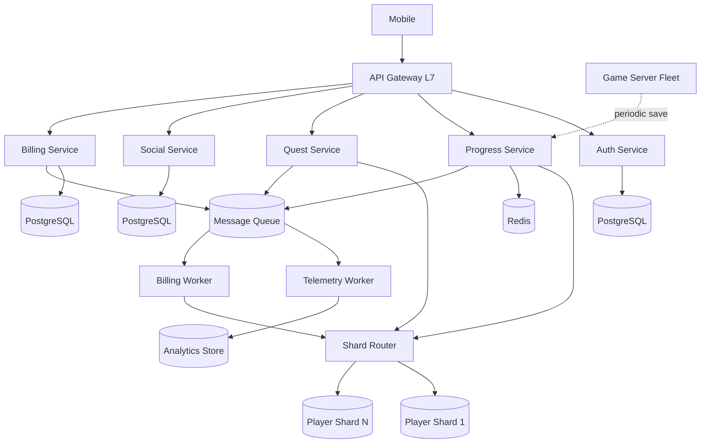
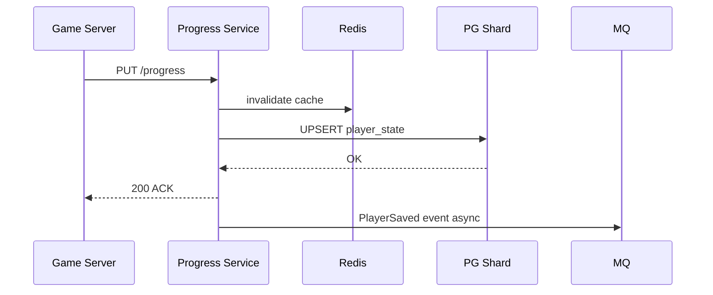

# Пример: mobile open-world game (GTA-like)

← [FRAMEWORK.md](../FRAMEWORK.md) · [instagram-feed.md](instagram-feed.md) · [paypal-payments.md](paypal-payments.md) · [vk-social.md](vk-social.md)

**Overview:** meta-game backend — account · quests · progress · friends · clans · billing · telemetry

*Mobile open-world по мотивам GTA-like; без привязки к конкретному тайтлу.*

---

## 1. FR (5–8 min)

| ID | Требование | Пояснение |
|----|------------|-----------|
| **FR-1** | Account — регистрация, login, link соцсети | OAuth; один аккаунт — несколько providers |
| **FR-2** | Player progress — save/load состояния | Уровень, инвентарь, позиция; не терять при crash |
| **FR-3** | Quests — accept / update / complete | State machine; награды атомарно с progress |
| **FR-4** | Friends + clans | Friend list, invite; clan ≤ 50 members |
| **FR-5** | In-app billing — purchase verify | Webhook store; идемпотентен |
| **FR-6** | Telemetry stream | Игровые события → analytics |

**UC → FR:** UC1 Login → FR-1 · UC2 Save progress → FR-2 · UC3 Complete quest → FR-3 · UC4 Clan invite → FR-4 · UC5 Purchase → FR-5 · UC6 Session events → FR-6

**Акторы:** Player · Mobile Client · Game Server · Auth · Progress · Quest · Social · Billing Service

**Интеграции:** OAuth providers (FR-1) · App Store / Google Play webhook (FR-5) · Analytics pipeline (FR-6)

**Out of scope:** game physics, netcode tick-rate, voice chat, anti-cheat ML, matchmaking PvP ranked

**ER:** Player 1──M QuestProgress · Player M──N Player · Clan 1──M Player

**На собесе уточни:** meta-game API vs dedicated game-server — здесь backend сервисы.

---

## 2. NFR (5–7 min)

### 2.1 Цифры на доску

**Допущения:** 200M registered · ~3M DAU · peak 20K CCU

| Вопрос | Формула / допущение | Результат | На доске |
|--------|---------------------|-----------|----------|
| Registered / DAU | ~1.5% reg | **200M / ~3M** | 3M DAU |
| Peak CCU | из контекста | **20K** | 20K CCU |
| Login QPS peak | 3M × 2 ÷ 86_400 × ×10 patch | **~700** | ~700 login/s peak |
| Progress save w/s | 20K ÷ 300 s | **~67** | ~67 w/s |
| Quest event w/s | 20K × 0.3/min ÷ 60 | **~100** | ~100 w/s |
| Telemetry events/s | 20K × 5/min ÷ 60 | **~1_700** | ~1.7K events/s |
| Progress storage | 3M × 50 KB | **~150 GB** | ~150 GB hot |
| Progress save p99 | 1× SSD + DC | **≤ 300 ms** | p99 ≤ 300 ms |
| Login p99 | cache + SSD | **≤ 500 ms** | p99 ≤ 500 ms |
| SLA uptime | product | **99.9%** | 99.9% |
| RPO / RTO | progress CP | **≈ 0** · **< 15 min** | RPO ≈ 0 · RTO 15m |

**Драйвер:** FR-2/FR-6 — **player state writes** + **telemetry flood** при 20K CCU.

### 2.2 Pillars + вывод

| ID | Pillar | Что спросят | На доске | типично для |
|----|--------|-------------|----------|-------------|
| O1 | Availability | multi-AZ, repl — HA | ✅ | — |
| O2 | Continuity | rolling deploy без downtime | ✅ | — |
| O3 | DR | warm tier | ✅ | game |
| S1 | Scalability | shard player_id, 20K CCU | **TOP-3** | game |
| S2 | Consistency | strong progress/quest | **TOP-3** | game |
| X1 | Caching | hot profile cache | ✅ | — |
| X2 | Processing | sync save + async telemetry | **TOP-3** | game |
| X3 | Observability | load tests | ✅ | — |
| X4 | Security | OAuth, billing signature | ✅ | payments |
| X5 | Distributed TX | quest reward + progress | ✅ | — |

**Вывод:** 20K CCU → progress writes + telemetry ~1.7K events/s → **§4.2** · **TOP-3:** S1 · S2 · X2

---

## 3. HLD (12–15 min)

### 3.1 API

| Endpoint | Зачем | Sync/Async |
|----------|-------|------------|
| `POST /v1/auth/login` | login + OAuth link | sync |
| `PUT /v1/players/{id}/progress` | checkpoint save | sync ACK |
| `POST /v1/quests/{id}/complete` | quest + reward | sync |
| `GET /v1/friends` | friend list | sync |
| `POST /v1/billing/webhook` | store receipt | sync verify, async grant |
| `POST /v1/events` | client telemetry batch | async ACK 202 |

### 3.2 Data

```
Player 1──M QuestProgress · Player M──N Player · Clan 1──M Player  *(ER — §1)*
Store roles: SQL DB (progress, social, quests) · Cache (session, profile) · Message queue (events) · Analytics store
```

### 3.3 HLD — схема системы



**UC: progress save (data flow):**



---

## 4. Deep Dive (15–18 min) · образец прохода

*Интервьюер выберет **1–2 темы** из 20K CCU / progress / billing. Не проходить все §4 подряд.*

**Типичный сценарий:** §4.2 · §4.4 или §4.3 — **по вопросу интервьюера**

### §4.2 DB + player state *(образец — единственный блок на доске)*

| Вопрос | ✅ |
|--------|-----|
| SQL vs NoSQL | **PostgreSQL** — transactions quest+reward, JSONB inventory |
| Shard key | **hash(`player_id`)** mod N; не geo (mobile open-world) |
| Hot profile | Redis cache-aside TTL 5 min; write-through на save |
| Hot zone spike | rate limit saves/player; queue overflow → client retry |
| HA | async repl per shard — **HA**; progress read primary on save path |

**Pull (если спросят):** S2/RPO progress consistency · X2 telemetry/billing async · edge security/rate limit · infra sizing — таблица ниже

### Infra sizing *(pull, ~2 min)*

| Компонент | Тех | Размер | Откуда |
|-----------|-----|--------|--------|
| API | Node.js K8s | ~2K RPS headroom | §2.1 login+quest peak |
| Player DB | PostgreSQL 16 shards | ~150 GB + growth | §2.1 storage |
| Cache | Redis cluster | hot 20K CCU profiles | §2.1 CCU |
| Broker | Kafka ×3 | ~2K msg/s telemetry | §2.1 events/s |
| Analytics | ClickHouse | telemetry 90d | batch from Kafka |
| Game servers | dedicated fleet | 20K CCU | out of API scope |

---

← [FRAMEWORK.md](../FRAMEWORK.md)
