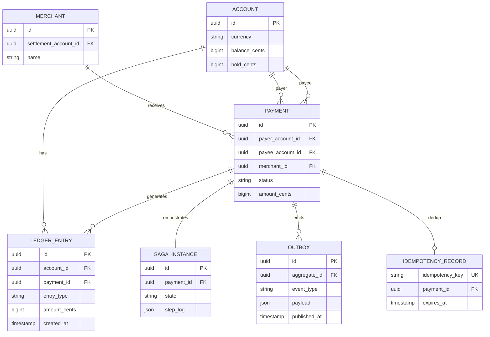
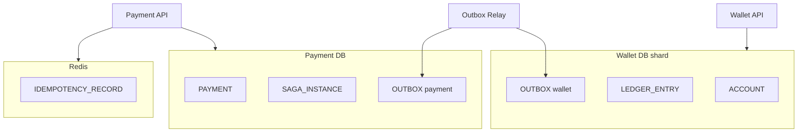
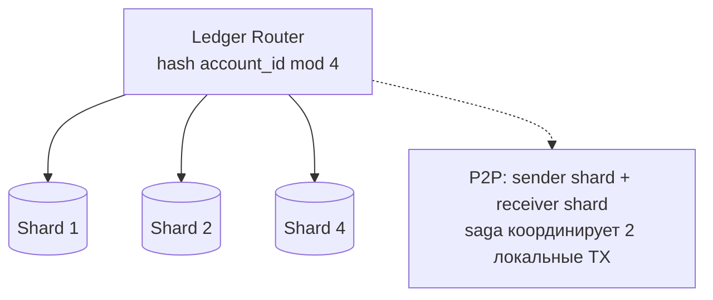
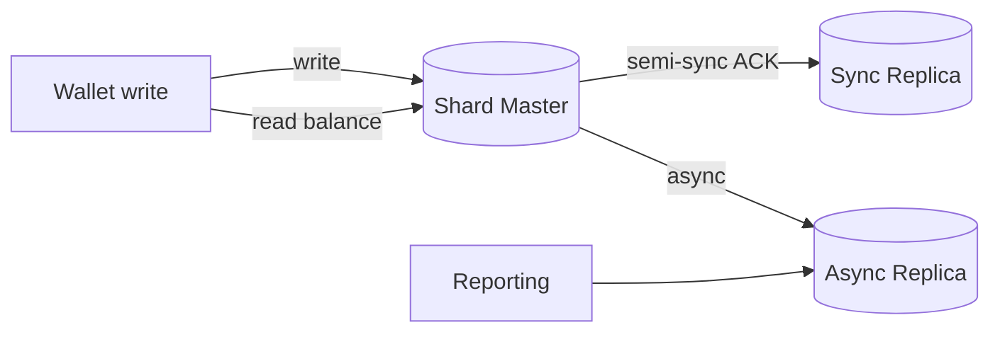
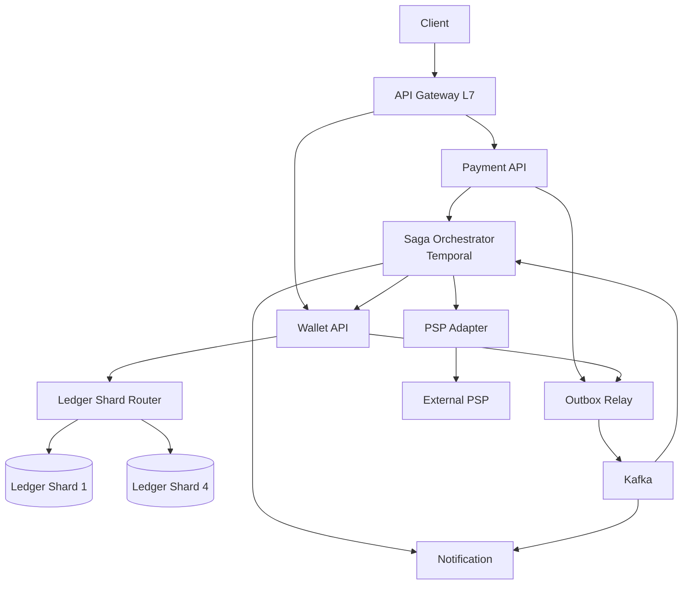
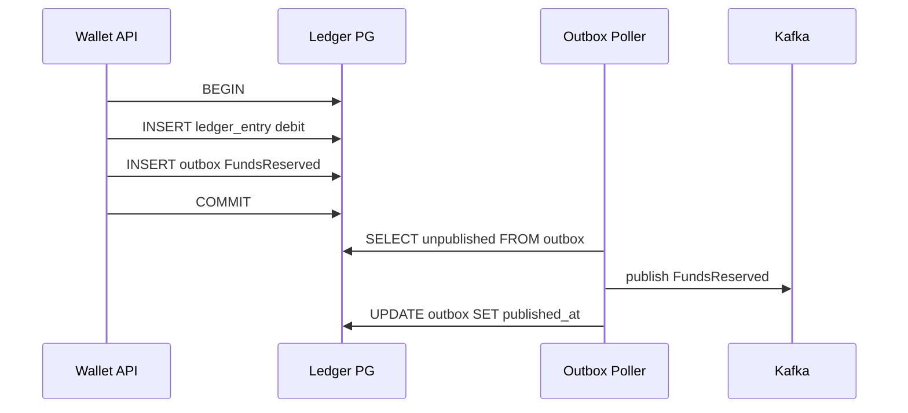
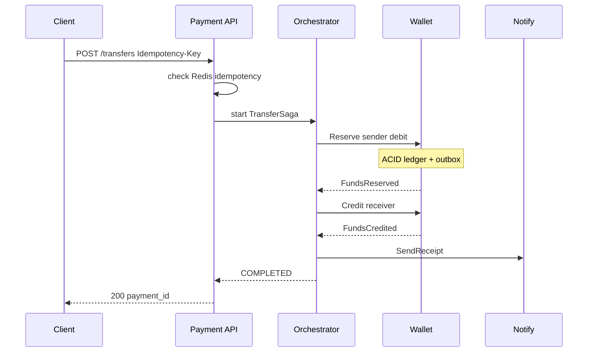
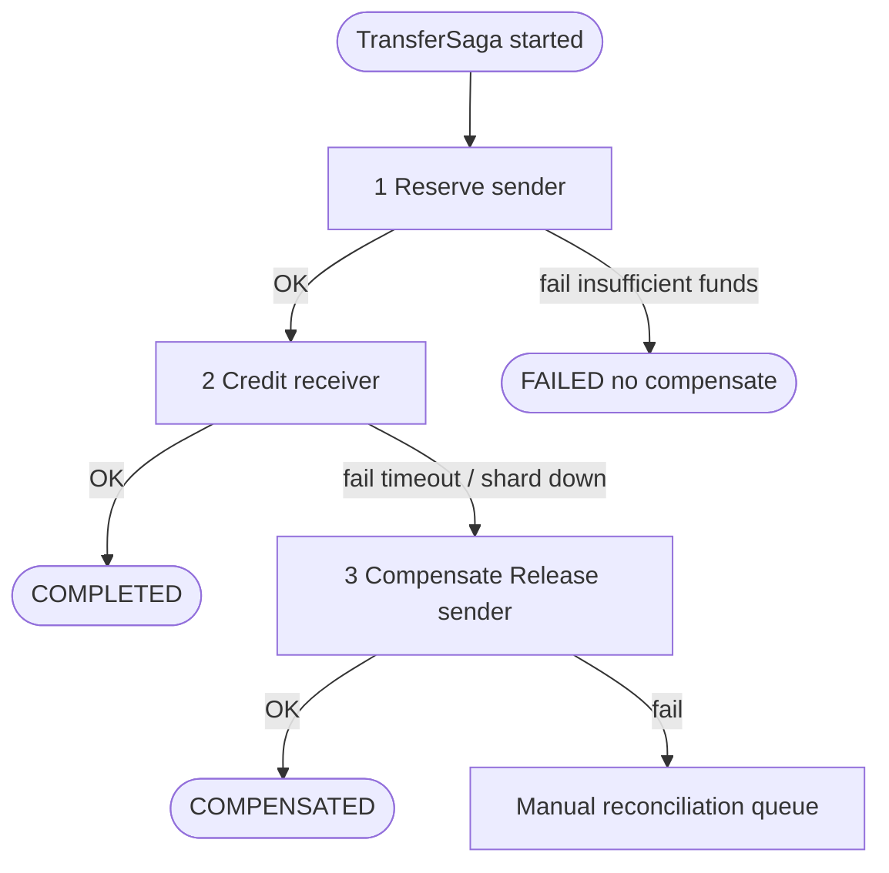
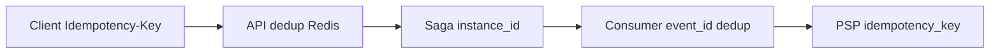
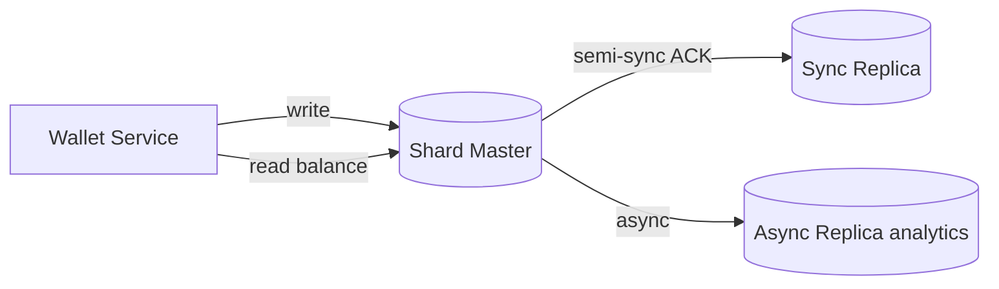

# Пример: PayPal-like payments

← [FRAMEWORK.md](../FRAMEWORK.md) · [instagram-feed.md](instagram-feed.md) — read-heavy пример

**100M accounts · P2P + merchant checkout · p99 initiate ≤ 500ms · settle ≤ 5s · SLA 99.99% · RPO ≈ 0 для ledger**

---

## 1. FR

| UC | Функция |
|----|---------|
| UC1 | P2P перевод (sender → receiver) |
| UC2 | Merchant checkout (hold → capture → settle) |
| UC3 | Top-up / withdraw через PSP |
| UC4 | Статус платежа · история · webhook merchant |

`Account 1──M Transaction · Payment 1──M LedgerEntry · Merchant 1──M Payment`

---

## 2. NFR

### 2.1 Входные допущения

| Параметр | Значение |
|----------|----------|
| Accounts | 100M |
| Tx | 5 / month / account |
| UC | P2P + merchant checkout |
| Ledger | double-entry (debit + credit) |

### 2.2 Capacity

| Метрика | Формула | Результат |
|---------|---------|-----------|
| Tx/month | 100M × 5 | **500M** |
| Peak TPS | 500M ÷ 30 ÷ 86_400 × 5 | **~1_000** |
| Ledger rows/month | 500M × 2 entries | **~1B** |
| Storage/month (ledger) | 1B × 200 B | **~200 GB** |

**Вывод:** CP ledger, sync path ≤ 500ms — orchestration + outbox в §6.

### 2.3 CAP / Consistency

| Участок | Требование |
|---------|------------|
| баланс / ledger | **strong (CP)** |
| между сервисами (saga) | eventual |

→ [CAP](../trade-offs/architecture/cap-pacelc-distributed.md) · [consistency](../trade-offs/constraints/consistency-as-nfr.md)

### 2.4 Latency

#### A. Sync — клиент ждёт

| UC | p99 SLO |
|----|---------|
| UC1 initiate transfer | ≤ 500ms |
| UC2 hold funds | ≤ 500ms |

#### B. Async — клиент не ждёт

| Процесс | SLO |
|---------|-----|
| settle / PSP capture | ≤ 5s |
| webhook merchant | секунды OK |

### 2.5 Throughput

Peak ~1_000 TPS · ledger 2× entries = ~2K row writes/s at peak.

### 2.6 Availability

| Параметр | Значение |
|----------|----------|
| SLA | 99.99% |
| RPO ledger | ≈ 0 |
| RTO | < 1 min |

### 2.7 Observability

| Signal | Зачем |
|--------|-------|
| saga state / step lag | stuck payments |
| outbox lag | lost events |
| duplicate rate | idempotency health |
| ledger drift | CP invariant |

---

## 3. API

| Вызов | UC | Заметка |
|-------|-----|---------|
| `POST /v1/transfers` | UC1 | sync 202 + poll · `Idempotency-Key` ([idempotency](../trade-offs/api/write-api-idempotency.md)) |
| `POST /v1/payments` | UC2 | hold → capture двухфазно |
| `POST /v1/wallet/topup` | UC3 | async · webhook PSP callback |
| `GET /v1/payments/{id}` | UC4 | read from primary shard |
| `POST /v1/webhooks/psp` | UC3,4 | dedup by `event_id` |

Протокол: **REST** + JSON ([rest-grpc-graphql](../trade-offs/api/rest-grpc-graphql.md)) · между сервисами — **async events** ([sync-async](../trade-offs/api/sync-async-messaging.md))

---

## 4. Data

**PostgreSQL ledger** — accounts, entries, payments, saga · **cache** — idempotency keys · **outbox table** — в каждой БД сервиса

### ER — core entities

double-entry: каждая TX = минимум **debit + credit** · баланс = sum(entries), не mutable column alone

### Размещение по store

ledger + outbox в **одной ACID TX** · idempotency hot path в Redis (TTL 72h)

### Шардирование — hash by account_id

P2P не один shard — orchestrator вызывает Reserve/Credit на разных shards → [sharding](../trade-offs/data/sharding-partitioning.md)

### Репликация — sync / semi-sync ledger

баланс / available funds — **только primary** · RPO ≈ 0 → [replication](../trade-offs/data/replication-sync-async.md)

| Тема | ✅ |
|------|-----|
| SQL + ACID для денег ([sql-nosql](../trade-offs/data/sql-vs-nosql-paradigm.md)) | PostgreSQL ledger |
| Double-entry, normalized ([norm-denorm](../trade-offs/data/normalization-denormalization.md)) | debit/credit пары |

### Indexing trade-offs → выбор

| Запрос (FR) | NFR | Алгоритм | Форма | Механика | ✅ |
|-------------|-----|----------|-------|----------|-----|
| баланс / ledger `WHERE account_id=? ORDER BY created_at` | CP · read primary | B-Tree | composite `(account_id, created_at)` | range history per account в sorted pages | да |
| idempotency lookup | p99 ≤ 500ms | B-Tree | UNIQUE `(idempotency_key)` | exact match, constraint + dedup | да |
| saga poll `instance_id` + active status | orchestrator poll | B-Tree | partial `WHERE status IN (...)` | меньше индекс → меньше write amplification | да |
| webhook dedup `event_id` | at-least-once | B-Tree | UNIQUE `(event_id)` | point lookup на duplicate event | да |

→ цепочка: [indexing](../trade-offs/data/indexing-strategy.md)

### Trade-offs → выбор (data + distributed TX)

| Тема | A / B | ✅ Выбор | Почему |
|------|-------|----------|--------|
| Distributed TX | 2PC / Saga | **Saga** | 2PC не масштабируется · блокирует PSP |
| Saga стиль ([orchestration](../trade-offs/architecture/orchestration-choreography-saga.md)) | orchestration / choreography | **orchestration** | 4+ шага · compliance · таймауты · компенсации в одном месте |
| Публикация событий ([saga-outbox](../trade-offs/architecture/saga-vs-outbox.md)) | direct publish / outbox | **transactional outbox** | crash после commit — событие не теряется |
| Дубликаты ([idempotency](../trade-offs/api/write-api-idempotency.md)) | client key / dedup table | **Idempotency-Key** + dedup webhook | retry + double-click + PSP callback ×2 |
| Репликация ledger ([replication](../trade-offs/data/replication-sync-async.md)) | sync / async | **sync semi-sync** | RPO ≈ 0 · баланс не может «отставать» |
| Шардирование ([sharding](../trade-offs/data/sharding-partitioning.md)) | range / hash | **hash(`account_id`) mod 4** | равномерно · P2P = 2 shards (sender+receiver) — saga координирует |
| Топология ([master-slave](../trade-offs/data/master-slave-multi-master.md)) | master-slave / multi-master | **master-slave** | один writer на shard — проще инвариант «balance ≥ 0» |

---

## 5. HLD

**5 сервисов** ([monolith-micro](../trade-offs/architecture/monolith-microservices.md)) · stateless API · **ledger stateful per shard**

### Общая схема

### Transactional Outbox (внутри сервиса)

одна ACID TX = бизнес-запись + outbox · consumer **идемпотентен** по `event_id`

### UC1 P2P — orchestration saga (happy path)

### UC1 — компенсация при сбое

компенсация = обратная ledger TX + outbox `FundsReleased` · **не** DELETE, а adjusting entry

### UC2 Merchant checkout — saga steps

| # | Шаг | Сервис | Локальная TX | Событие outbox |
|---|-----|--------|--------------|----------------|
| 1 | Create payment PENDING | Payment | payment row + outbox | `PaymentCreated` |
| 2 | Hold funds | Wallet | debit hold + outbox | `FundsHeld` |
| 3 | Capture via PSP | PSP Adapter | idempotent call + outbox | `PSPCaptured` |
| 4 | Settle to merchant | Wallet | credit merchant + outbox | `FundsSettled` |
| ↩ | PSP fail | Orchestrator | — | compensate: `ReleaseHold` → `PaymentFailed` |

### Идемпотентность — три слоя

### Ledger — sync replication

баланс / available funds — **только primary** · analytics — async replica

### Сбой

| Сбой | Поведение |
|------|-----------|
| Crash после COMMIT, до publish | outbox poller догоняет · at-least-once |
| Duplicate Kafka event | consumer dedup `event_id` · no double debit |
| PSP timeout | saga timer → compensate hold · status `FAILED` |
| Orchestrator down | Temporal восстанавливает workflow · workers idempotent |
| Split-brain shard | sync repl + fencing · manual playbooks |

---

## 6. Technology choices

### Orchestrator (multi-step saga)

| Вопрос | Если да | Если нет |
|--------|---------|----------|
| 4+ шага с таймаутами / compensate? | orchestration (Temporal) | choreography |
| Compliance / audit trail? | central workflow state | — |
| **✅ Выбор** | **Temporal** | UC1/UC2 saga, timers, replay |

→ [orchestration](../trade-offs/architecture/orchestration-choreography-saga.md) · [saga-outbox](../trade-offs/architecture/saga-vs-outbox.md)

### Broker (outbox relay + saga events)

| Вопрос | Если да | Если нет |
|--------|---------|----------|
| At-least-once + replay? | log (Kafka) | task queue |
| Outbox poller → many consumers? | pub/sub | point-to-point |
| **✅ Выбор** | **Kafka** | outbox relay, saga fan-out |

→ [messaging](../trade-offs/architecture/messaging-patterns.md) · [brokers](../trade-offs/technologies/message-brokers.md)

### Ledger DB

| Вопрос | Выбор |
|--------|-------|
| ACID + double-entry | PostgreSQL |
| RPO ≈ 0 | sync / semi-sync replication |
| ~1K TPS peak | 4 shards `hash(account_id)` |

→ [replication](../trade-offs/data/replication-sync-async.md) · [sharding](../trade-offs/data/sharding-partitioning.md)

### Idempotency store

| Вопрос | Выбор |
|--------|-------|
| TTL keys 72h, p99 lookup | Redis |
| Webhook dedup | UNIQUE index в PG |

→ [idempotency](../trade-offs/api/write-api-idempotency.md)

### Infra

| Компонент | Тех | Размер | Откуда |
|-----------|-----|--------|--------|
| Gateway | ALB L7 / Kong | ~1K TPS | §2.5 |
| Orchestrator | Temporal | workflow state | §2.4 saga steps |
| Broker | Kafka, 5 brokers | outbox + saga | §6 broker tree |
| Ledger DB | PG, 4 shards, sync repl | ~200 GB/mo | §2.2 |
| Idempotency | Redis cluster | TTL 72h | §2.4 sync path |
| PSP | Stripe / card network | isolated VPC | PCI scope |
| API | K8s | stateless pods | §2.5 |

Security: JWT · mTLS internal · PCI только PSP adapter → [gateway](../trade-offs/technologies/api-gateways.md)

---

← [FRAMEWORK.md](../FRAMEWORK.md)
