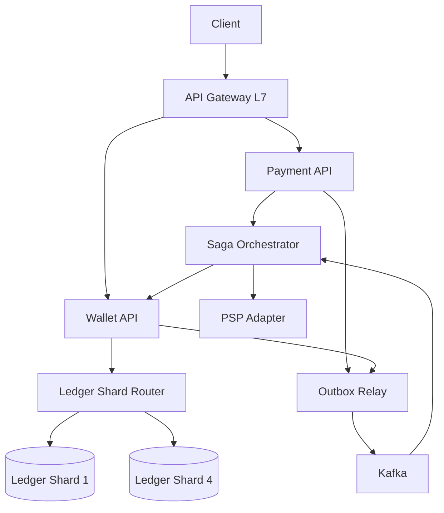
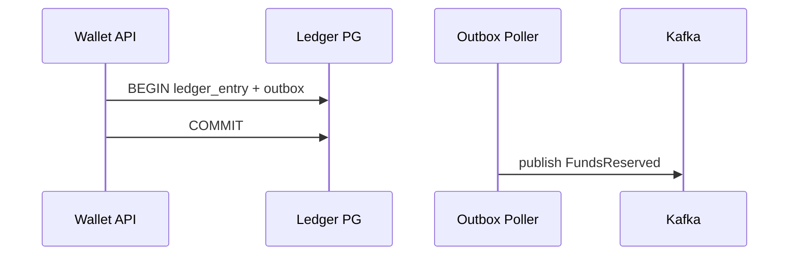

# Пример: PayPal-like payments

← [FRAMEWORK.md](../FRAMEWORK.md) · [instagram-feed.md](instagram-feed.md)

**Overview:** POST transfer → saga → ledger debit/credit

---

## 1. FR (5–8 min)

| ID | Требование | Пояснение |
|----|------------|-----------|
| **FR-1** | P2P перевод sender → receiver | Double-entry: debit + credit |
| **FR-2** | Merchant checkout hold → capture → settle | Двухфазно через PSP |
| **FR-3** | Insufficient funds → fail без partial debit | Reserve atomic |
| **FR-4** | **Idempotency-Key** на все POST write | Retry → тот же payment_id |
| **FR-5** | Ledger **immutable** — audit trail | Компенсация = adjusting entry |
| **FR-6** | Balance read только с **primary** shard | Не с async replica |

**UC → FR:** UC1 P2P перевод → FR-1, FR-4 · UC2 Merchant checkout → FR-2 · UC3 Проверить баланс → FR-6

**Акторы:** User · Merchant · Payment API · Wallet API · Saga Orchestrator · PSP

**Интеграции:** PSP — hold/capture/settle (FR-2)

**Out of scope:** FX, chargeback automation, crypto

**ER:** Account 1──M LedgerEntry · Payment 1──M LedgerEntry · Merchant 1──M Payment

---

## 2. NFR (5–7 min)

### 2.2 Расчёты

**Допущения:** 100M accounts · P2P + merchant checkout · CP ledger

| Метрика | Формула | Результат |
|---------|---------|-----------|
| Accounts | — | **100M** |
| Peak TPS | 100M × 5/mo ÷ 30 ÷ 86_400 | **~1_000** |
| Ledger rows/mo | 500M tx × 2 entries | **~1B** |
| Storage / mo | 1B × 200 B | **~200 GB** |

**Драйвер:** FR-6 — CP ledger, RPO ≈ 0; saga + cross-shard P2P.

### 2.3 SLA / SLO

| Метрика | Цель |
|---------|------|
| Initiate p99 | **≤ 500 ms** |
| Settle E2E p95 | **≤ 5 s** |
| SLA uptime | **99.99%** |
| RPO ledger | **≈ 0** · RTO **< 1 min** |

**POST /transfers breakdown:**

| Этап | p50 | p99 |
|------|-----|-----|
| API + idempotency + saga reserve | ~108 ms | **≤ 500 ms** |

### 2.4 Throughput

Peak ~1_000 TPS · ledger ~2K row writes/s · burst ×3 payday · headroom ×2.

### 2.5 Observability

| Метрика | Зачем |
|---------|-------|
| `saga_step_lag_seconds` | stuck payments |
| `outbox_unpublished_count` | lost events risk |
| `ledger_balance_drift` | CP invariant |

### 2.6 Master Catalog — pillars

| ID | Pillar | ✅ / — | Направление | Почему §2.2/FR | TOP-3? |
|----|--------|--------|-------------|----------------|--------|
| O1 | Availability | ✅ | semi-sync repl — HA | SLA 99.99% | — |
| O2 | Continuity | — | — | не спрашивали | — |
| O3 | DR | ✅ | **hot** tier | RPO ≈ 0, RTO < 1 min | **да** |
| S1 | Scalability | ✅ | 4 shards hash account_id | ~1K TPS | — |
| S2 | Consistency | ✅ | CP ledger | FR-6, RPO ≈ 0 | **да** |
| X1 | Caching | ✅ | Redis idempotency | sync path dedup | — |
| X2 | Processing | ✅ | sync initiate, async settle | FR-2 merchant | — |
| X3 | Observability | ✅ | §2.5 metrics | saga/outbox SLO | — |
| X4 | Security | ✅ | JWT, rate limit, PCI scope | FR-4 idempotency | — |
| X5 | Distributed TX | ✅ | saga + outbox | cross-shard P2P | **да** |

### 2.7 Processing paths + DR tier

| Path | Core UC | Когда | Механизм |
|------|---------|-------|----------|
| **Sync** | POST /transfers, balance read | user ждёт ACK | API → ledger primary |
| **Async** | merchant settle, saga steps | PSP timeout, cross-shard | Kafka + orchestrator |
| **Batch** | — | — | N/A |

**DR tier (O3):** Hot — RPO ≈ 0, RTO < 1 min · semi-sync repl, auto failover.

### 2.8 Bottleneck → START §4

**START:** CP ledger + RPO ≈ 0 → **§4.4 → §4.2** (pillars O3, S2) · **AGENDA:** также X5 → §4.3

---

## 3. HLD (12–15 min)

### 3.1 API

| Endpoint | Зачем | Sync/Async |
|----------|-------|------------|
| `POST /v1/transfers` | P2P | sync + Idempotency-Key |
| `POST /v1/payments` | merchant hold/capture | sync initiate, async settle |
| `GET /v1/payments/{id}` | status | sync, read primary |

### 3.2 Data

```
Account 1──M LedgerEntry · Payment 1──M LedgerEntry · Merchant 1──M Payment
Store: PostgreSQL ledger (sharded) + Redis (idempotency) + outbox table
```

### 3.3 HLD — схема системы



### 3.4 TOP-3 pillars · agenda §4

| # | Pillar (ID) | ✅ Направление | §4 (блок) | Почему |
|---|-------------|----------------|-----------|--------|
| 1 | **O3** DR | hot tier, RPO ≈ 0 | §4.4 | §2.3 RPO/RTO |
| 2 | **S2** Consistency | CP ledger | §4.4 | FR-6 |
| 3 | **X5** Distributed TX | saga + outbox | §4.3 | cross-shard P2P |

Implementation: semi-sync repl, orchestration vs 2PC — §4, не в TOP-3.

---

## 4. Deep Dive (15–18 min) · образец прохода

*Интервьюер выберет **1–2 темы** — обычно CP/ledger, не все блоки. Ниже — как углубиться, если повели туда.*

**Типичный сценарий:** START §4.4 → §4.2 · §4.3 saga — **только если спросят**

### §4.4 CAP + failures *(образец — блок START для CP/money)*

CP ledger · semi-sync repl · saga compensate on PSP timeout.

| Сбой | Поведение |
|------|-----------|
| Crash after COMMIT | Outbox poller догоняет |
| Duplicate Kafka event | Consumer dedup `event_id` |

### §4.2 DB + ledger *(образец — продолжение START)*

PostgreSQL double-entry · hash(`account_id`) mod 4 · Redis idempotency TTL 72h.

### §4.3 Broker + outbox *(pull — если спросят про X5 / saga)*

Kafka — outbox relay + saga events.



### Infra sizing

| Компонент | Тех | Размер | Откуда |
|-----------|-----|--------|--------|
| Orchestrator | Temporal | workflow state | saga steps |
| Broker | Kafka ×5 | outbox + saga | §2.2 TPS |
| Ledger DB | PG 4 shards, sync repl | ~200 GB/mo | §2.2 storage |
| Idempotency | Redis cluster | TTL 72h | sync path |
| Gateway | ALB L7 | ~1K TPS | §2.2 peak |

---

← [FRAMEWORK.md](../FRAMEWORK.md)
