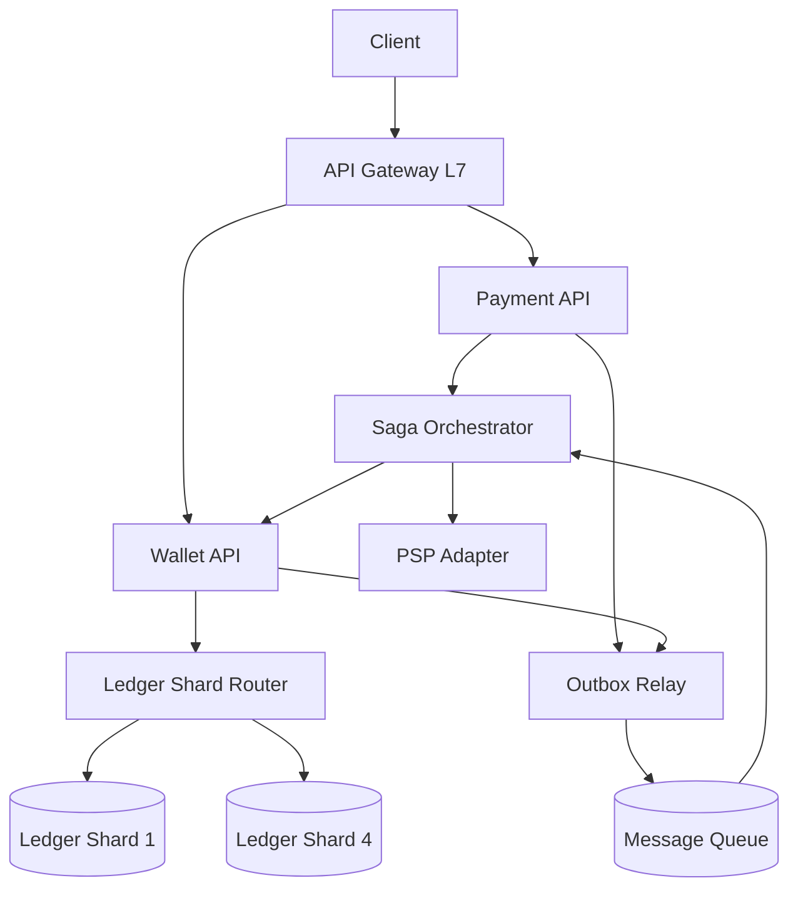
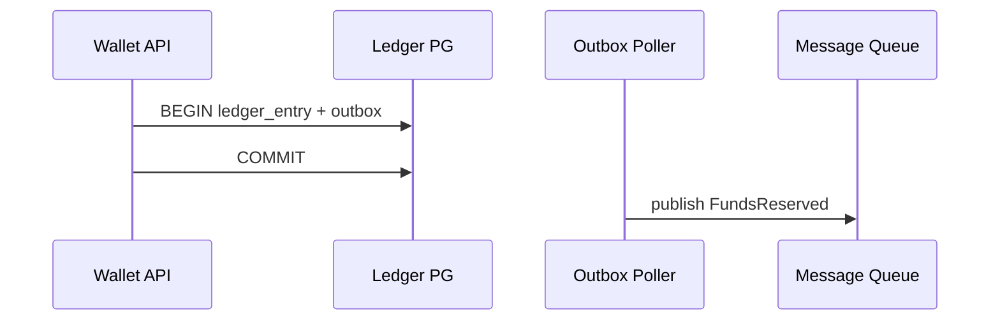

# Пример: PayPal-like payments

← [FRAMEWORK.md](../FRAMEWORK.md) · [instagram-feed.md](instagram-feed.md)

**Overview:** POST transfer → saga → ledger debit/credit

---

## 1. FR (5–8 min)

| ID | Требование | Пояснение |
|----|------------|-----------|
| **FR-1** | P2P перевод sender → receiver | Double-entry: debit + credit |
| **FR-2** | Merchant checkout hold → capture → settle | Двухфазно через PSP |
| **FR-3** | Insufficient funds → fail без partial debit | Reserve atomic |
| **FR-4** | **Idempotency-Key** на все POST write | Retry → тот же payment_id |
| **FR-5** | Ledger **immutable** — audit trail | Компенсация = adjusting entry |
| **FR-6** | Balance read только с **primary** shard | Не с async replica |

**UC → FR:** UC1 P2P перевод → FR-1, FR-4 · UC2 Merchant checkout → FR-2 · UC3 Проверить баланс → FR-6

**Акторы:** User · Merchant · Payment API · Wallet API · Saga Orchestrator · PSP

**Интеграции:** PSP — hold/capture/settle (FR-2)

**Out of scope:** FX, chargeback automation, crypto

**ER:** Account 1──M LedgerEntry · Payment 1──M LedgerEntry · Merchant 1──M Payment

---

## 2. NFR (5–7 min)

### 2.1 Цифры на доску

**Допущения:** 100M accounts · P2P + merchant checkout · CP ledger

| Вопрос | Формула / допущение | Результат | На доске |
|--------|---------------------|-----------|----------|
| Accounts | — | **100M** | 100M |
| Peak TPS | 100M × 5/mo ÷ 30 ÷ 86_400 | **~1_000** | ~1K TPS |
| Ledger rows/mo | 500M tx × 2 entries | **~1B** | 1B rows/mo |
| Storage / mo | 1B × 200 B | **~200 GB** | ~200 GB/mo |
| Peak burst | avg × ×3 payday | **~3K TPS** | burst ×3 |
| Initiate p99 | API + idempotency + saga ~108 ms p50 | **≤ 500 ms** | p99 ≤ 500 ms |
| Settle E2E p95 | async saga | **≤ 5 s** | settle ≤ 5 s |
| SLA uptime | product | **99.99%** | 99.99% |
| RPO / RTO | CP ledger | **≈ 0** · **< 1 min** | RPO ≈ 0 · RTO 1m |

**Драйвер:** FR-6 — CP ledger, RPO ≈ 0; saga + cross-shard P2P.

### 2.2 Pillars + вывод

| ID | Pillar | Что спросят | На доске | типично для |
|----|--------|-------------|----------|-------------|
| O1 | Availability | semi-sync repl — HA | ✅ | — |
| O2 | Continuity | — | — | — |
| O3 | DR | hot tier | **TOP-3** | CP/money |
| S1 | Scalability | 4 shards hash account_id | ✅ | CP/money |
| S2 | Consistency | CP ledger | **TOP-3** | CP/money |
| X1 | Caching | key-value dedup | ✅ | — |
| X2 | Processing | sync initiate, async settle | ✅ | CP/money |
| X3 | Observability | saga/outbox SLO | ✅ | — |
| X4 | Security | JWT, rate limit, PCI scope | ✅ | payments |
| X5 | Distributed TX | saga + outbox | **TOP-3** | CP/money |

**Вывод:** CP ledger + RPO ≈ 0 → **§4.4 → §4.2** · **TOP-3:** O3 · S2 · X5

---

## 3. HLD (12–15 min)

### 3.1 API

| Endpoint | Зачем | Sync/Async |
|----------|-------|------------|
| `POST /v1/transfers` | P2P | sync + Idempotency-Key |
| `POST /v1/payments` | merchant hold/capture | sync initiate, async settle |
| `GET /v1/payments/{id}` | status | sync, read primary |

### 3.2 Data

```
Account 1──M LedgerEntry · Payment 1──M LedgerEntry · Merchant 1──M Payment  *(ER — §1)*
Store roles: SQL DB ledger (sharded) · Cache (idempotency) · outbox table
```

### 3.3 HLD — схема системы



---

## 4. Deep Dive (15–18 min) · образец прохода

*Интервьюер выберет **1–2 темы** — обычно CP/ledger, не все блоки. Ниже — как углубиться, если повели туда.*

**Типичный сценарий:** §4.4 → §4.2 · §4.3 saga — **только если спросят**

### §4.4 + §4.2 *(образец — CP/money, один блок на доске)*

CP ledger · semi-sync repl · PostgreSQL double-entry · hash(`account_id`) mod 4 · Redis idempotency TTL 72h.

| Сбой | Поведение |
|------|-----------|
| Crash after COMMIT | Outbox poller догоняет |
| Duplicate event | Consumer dedup `event_id` |
| PSP timeout | Saga compensate |

**Pull (если спросят):** saga + outbox + Kafka (X5) — sequence diagram ниже · infra sizing — таблица



### Infra sizing *(pull, ~2 min)*

| Компонент | Тех | Размер | Откуда |
|-----------|-----|--------|--------|
| Orchestrator | Temporal | workflow state | saga steps |
| Broker | Kafka ×5 | outbox + saga | §2.1 TPS |
| Ledger DB | PG 4 shards, sync repl | ~200 GB/mo | §2.1 storage |
| Idempotency | Redis cluster | TTL 72h | sync path |
| Gateway | ALB L7 | ~1K TPS | §2.1 peak |

---

← [FRAMEWORK.md](../FRAMEWORK.md)
