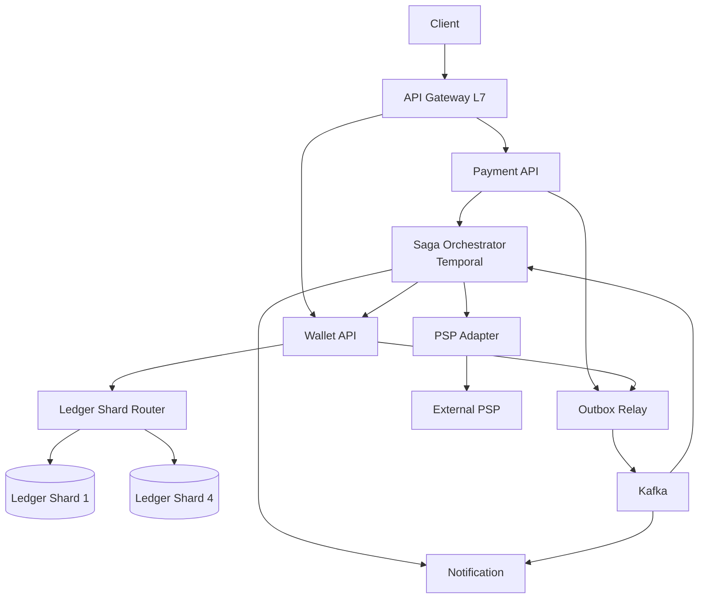
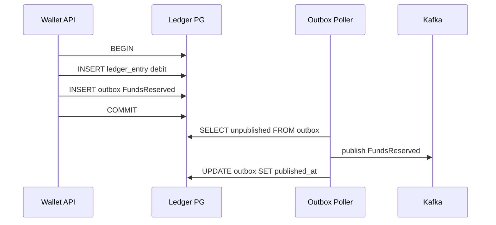
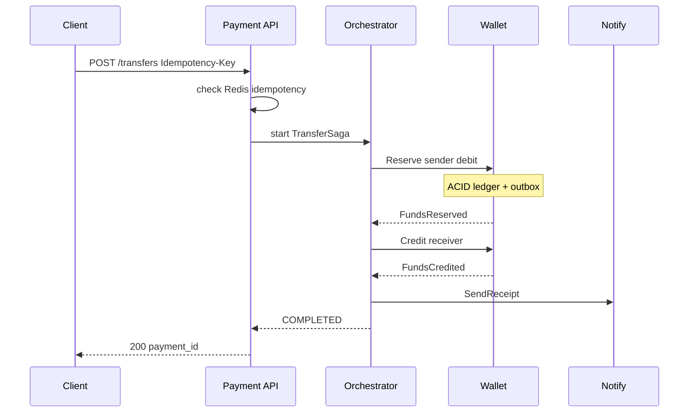
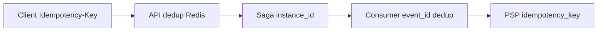
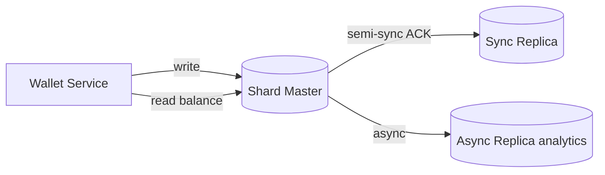

# Пример: PayPal-like payments

← [FRAMEWORK.md](../FRAMEWORK.md) · [instagram-feed.md](instagram-feed.md) — read-heavy пример

**100M accounts · P2P + merchant checkout · p99 initiate ≤ 500ms · settle ≤ 5s · SLA 99.99% · RPO ≈ 0 для ledger**

---

## 1. FR

| UC | Функция |
|----|---------|
| UC1 | P2P перевод (sender → receiver) |
| UC2 | Merchant checkout (hold → capture → settle) |
| UC3 | Top-up / withdraw через PSP |
| UC4 | Статус платежа · история · webhook merchant |

`Account 1──M Transaction · Payment 1──M LedgerEntry · Merchant 1──M Payment`

---

## 2. NFR + trade-offs

### Расчёты

```
Tx/month   = 100M × 5 ≈ 500M          Peak TPS ≈ 500M ÷ 30 ÷ 86_400 × 5 ≈ 1_000
Ledger rows = 2 entries/tx (debit+credit) ≈ 1B rows/мес
Storage    ≈ 1B × 200 B ≈ 200 GB/мес (ledger only)
```

| Блок | ✅ Выбор |
|------|----------|
| **Performance** | p99 initiate ≤ 500ms sync · settle async OK ([latency](../trade-offs/constraints/latency-vs-throughput.md)) |
| Scalability | ledger shard by `account_id` · stateless API ([sharding](../trade-offs/data/sharding-partitioning.md)) |
| **Consistency** | **CP ledger** · strong balance · eventual между сервисами ([CAP](../trade-offs/architecture/cap-pacelc-distributed.md) · [consistency](../trade-offs/constraints/consistency-as-nfr.md)) |
| Reliability | RPO ≈ 0 ledger · RTO < 1 min · multi-AZ ([availability](../trade-offs/constraints/availability-slo-rpo-rto.md)) |
| Observability | saga state, outbox lag, duplicate rate, ledger drift ([observability](../trade-offs/architecture/observability-architecture.md)) |
| Processing | **orchestration saga** + **outbox** в каждом сервисе ([saga-outbox](../trade-offs/architecture/saga-vs-outbox.md)) |
| Security | JWT · mTLS internal · PCI scope только PSP adapter ([gateway](../trade-offs/technologies/api-gateways.md)) |

### Infra

| Компонент | Тех | Размер |
|-----------|-----|--------|
| API Gateway | Kong / AWS ALB L7 | ~1K TPS peak |
| Saga Orchestrator | Temporal | workflow state · timers |
| Kafka | 5 brokers | saga events · outbox relay |
| PG Ledger | 4 shards · sync repl | double-entry per shard |
| Redis | cluster | idempotency keys TTL 72h |
| PSP Adapter | isolated VPC | Stripe / card network |

---

## 3. API

| Вызов | UC | Заметка |
|-------|-----|---------|
| `POST /v1/transfers` | UC1 | sync 202 + poll · `Idempotency-Key` ([idempotency](../trade-offs/api/write-api-idempotency.md)) |
| `POST /v1/payments` | UC2 | hold → capture двухфазно |
| `POST /v1/wallet/topup` | UC3 | async · webhook PSP callback |
| `GET /v1/payments/{id}` | UC4 | read from primary shard |
| `POST /v1/webhooks/psp` | UC3,4 | dedup by `event_id` |

Протокол: **REST** + JSON ([rest-grpc-graphql](../trade-offs/api/rest-grpc-graphql.md)) · между сервисами — **events** Kafka ([sync-async](../trade-offs/api/sync-async-messaging.md) · [messaging](../trade-offs/architecture/messaging-patterns.md))

---

## 4. Data

**Ledger PG** — `accounts`, `ledger_entries`, `payments`, `saga_instances` · **Redis** — `idempotency:{key}` · **Outbox** — `outbox_events` в каждой БД сервиса

| Тема | ✅ |
|------|-----|
| SQL + ACID для денег ([sql-nosql](../trade-offs/data/sql-vs-nosql-paradigm.md)) | PostgreSQL ledger |
| Double-entry, normalized ([norm-denorm](../trade-offs/data/normalization-denormalization.md)) | debit/credit пары |

### Indexing trade-offs → выбор

| Запрос (FR) | NFR | Алгоритм | Форма | Механика | ✅ |
|-------------|-----|----------|-------|----------|-----|
| баланс / ledger `WHERE account_id=? ORDER BY created_at` | CP · read primary | B-Tree | composite `(account_id, created_at)` | range history per account в sorted pages | да |
| idempotency lookup | p99 ≤ 500ms | B-Tree | UNIQUE `(idempotency_key)` | exact match, constraint + dedup | да |
| saga poll `instance_id` + active status | orchestrator poll | B-Tree | partial `WHERE status IN (...)` | меньше индекс → меньше write amplification | да |
| webhook dedup `event_id` | at-least-once | B-Tree | UNIQUE `(event_id)` | point lookup на duplicate event | да |

→ цепочка: [indexing](../trade-offs/data/indexing-strategy.md)

### Trade-offs → выбор (data + distributed TX)

| Тема | A / B | ✅ Выбор | Почему |
|------|-------|----------|--------|
| Distributed TX | 2PC / Saga | **Saga** | 2PC не масштабируется · блокирует PSP |
| Saga стиль ([orchestration](../trade-offs/architecture/orchestration-choreography-saga.md)) | orchestration / choreography | **orchestration** | 4+ шага · compliance · таймауты · компенсации в одном месте |
| Публикация событий ([saga-outbox](../trade-offs/architecture/saga-vs-outbox.md)) | direct publish / outbox | **transactional outbox** | crash после commit — событие не теряется |
| Дубликаты ([idempotency](../trade-offs/api/write-api-idempotency.md)) | client key / dedup table | **Idempotency-Key** + dedup webhook | retry + double-click + PSP callback ×2 |
| Репликация ledger ([replication](../trade-offs/data/replication-sync-async.md)) | sync / async | **sync semi-sync** | RPO ≈ 0 · баланс не может «отставать» |
| Шардирование ([sharding](../trade-offs/data/sharding-partitioning.md)) | range / hash | **hash(`account_id`) mod 4** | равномерно · P2P = 2 shards (sender+receiver) — saga координирует |
| Топология ([master-slave](../trade-offs/data/master-slave-multi-master.md)) | master-slave / multi-master | **master-slave** | один writer на shard — проще инвариант «balance ≥ 0» |

---

## 5. HLD

**5 сервисов** ([monolith-micro](../trade-offs/architecture/monolith-microservices.md)) · stateless API · **ledger stateful per shard**

### Общая схема



### Transactional Outbox (внутри сервиса)



одна ACID TX = бизнес-запись + outbox · consumer **идемпотентен** по `event_id`

### UC1 P2P — orchestration saga (happy path)



### UC1 — компенсация при сбое


компенсация = обратная ledger TX + outbox `FundsReleased` · **не** DELETE, а adjusting entry

### UC2 Merchant checkout — saga steps

| # | Шаг | Сервис | Локальная TX | Событие outbox |
|---|-----|--------|--------------|----------------|
| 1 | Create payment PENDING | Payment | payment row + outbox | `PaymentCreated` |
| 2 | Hold funds | Wallet | debit hold + outbox | `FundsHeld` |
| 3 | Capture via PSP | PSP Adapter | idempotent call + outbox | `PSPCaptured` |
| 4 | Settle to merchant | Wallet | credit merchant + outbox | `FundsSettled` |
| ↩ | PSP fail | Orchestrator | — | compensate: `ReleaseHold` → `PaymentFailed` |

### Идемпотентность — три слоя



### Ledger — sync replication



баланс / available funds — **только primary** · analytics — async replica

### Сбой

| Сбой | Поведение |
|------|-----------|
| Crash после COMMIT, до publish | outbox poller догоняет · at-least-once |
| Duplicate Kafka event | consumer dedup `event_id` · no double debit |
| PSP timeout | saga timer → compensate hold · status `FAILED` |
| Orchestrator down | Temporal восстанавливает workflow · workers idempotent |
| Split-brain shard | sync repl + fencing · manual playbooks |

---

← [FRAMEWORK.md](../FRAMEWORK.md)
