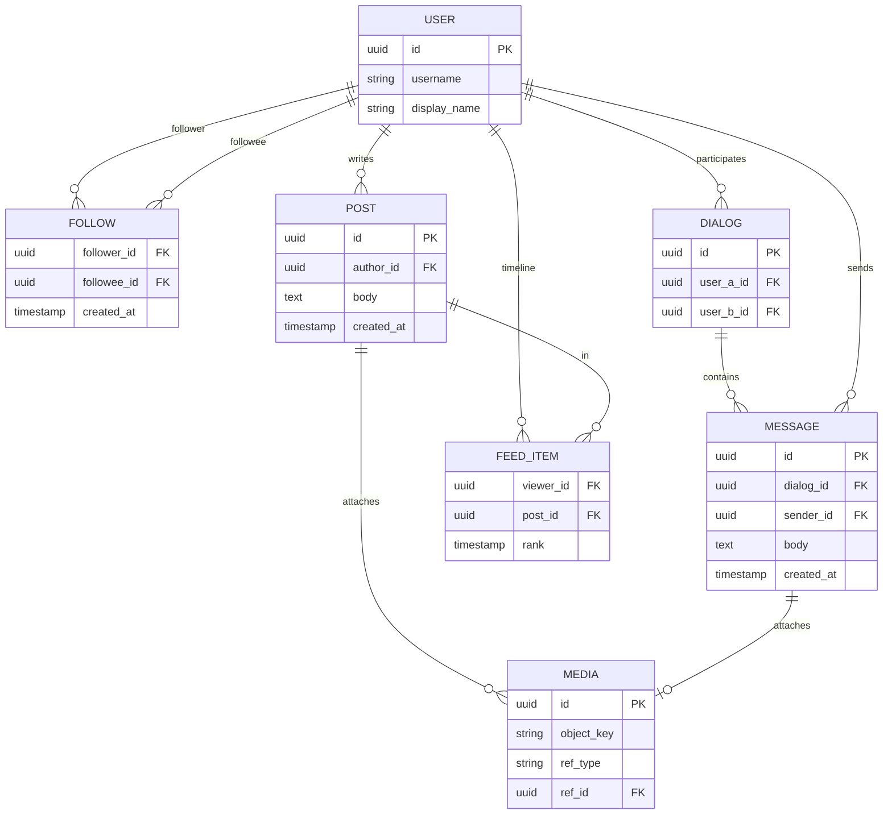
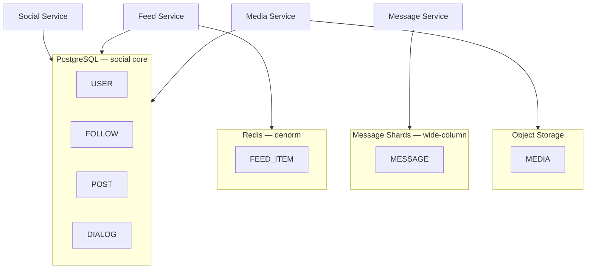
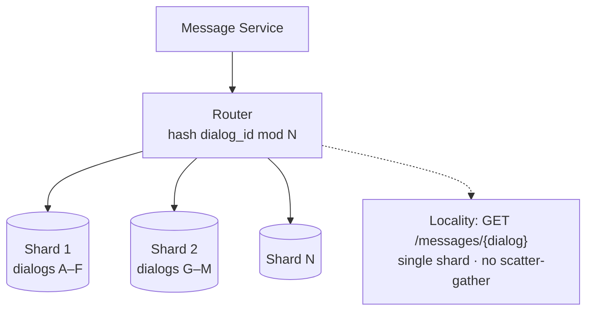
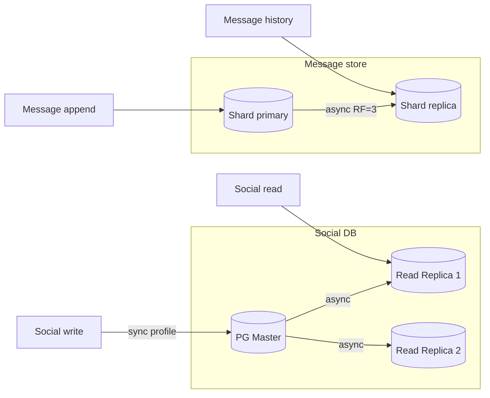
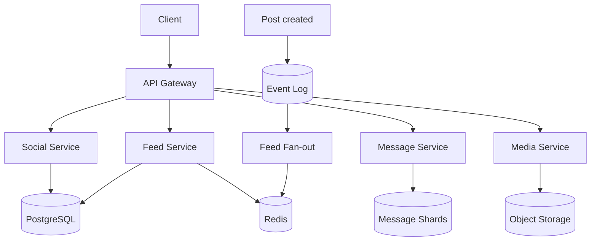
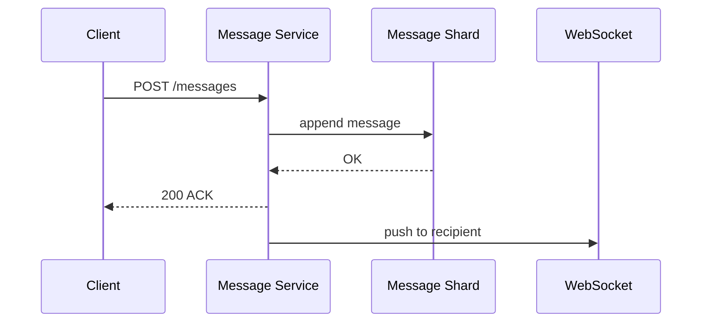

# Пример: VK-like social (capstone)

← [FRAMEWORK.md](../FRAMEWORK.md) · [instagram-feed.md](instagram-feed.md) · [paypal-payments.md](paypal-payments.md)

**Overview:** social graph + feed + messaging · bottleneck = **18.5K msg w/s + 580 TB retention** → message shards first, feed CDN second

**80M DAU · friends + feed + messages + media · messages retention 5 лет**

---

## 1. FR

| ID | Требование | Пояснение |
|----|------------|-----------|
| **FR-1** | Profile + follow / unfollow | Strong consistency на graph; unfollow убирает из feed scope |
| **FR-2** | Feed — посты **только друзей** | Reverse chrono; не global explore |
| **FR-3** | Send message — **sync ACK**, delivery async | Client получает 200 после append; push — optional |
| **FR-4** | Message order **per dialog** | Ordering внутри чата; cross-dialog order не гарантируем |
| **FR-5** | Media attach к post или message | Presigned upload; metadata в PG / message store |
| **FR-6** | Retention messages **5 лет** | Append-only; TTL или partition drop после 5y |
| **FR-7** | At-least-once delivery + **dedup** | Duplicate push не показывает два сообщения client-side |
| **FR-8** | Hot dialog / celebrity messaging | Один dialog_id — высокий write rate; shard hotspot |
| **FR-9** | WebSocket push optional | Pull `GET /messages/{dialog}` always works |
| **FR-10** | Feed fan-out async | Как Instagram FR-5; stale feed OK |
| **FR-11** | **⚠️ Собес:** shard by `dialog_id` vs `user_id` | Locality history read vs balance writes |

### UC → FR

| UC | FR |
|----|-----|
| UC1 Профиль, друзья | FR-1 |
| UC2 Лента постов | FR-2, FR-10 |
| UC3 Личные сообщения | FR-3, FR-4, FR-7, FR-8, FR-9 |
| UC4 Медиа | FR-5, FR-6 |

**Out of scope:** groups, voice/video calls, E2E encryption, global search

**ER:** User M──N User (friends) · User 1──M Post · User 1──M Message · Post 1──M Media

---

## 2. NFR

### 2.1 Входные допущения

| Параметр | Значение |
|----------|----------|
| DAU | 80M |
| Posts | 0.3 / day / active user |
| Feed reads | 8× / day |
| Messages | 20 / day / active user |
| Avg message | 200 B text + 10% with 500 KB media |
| Retention messages | 5 лет |

**Драйвер дизайна:** FR-6 → 580 TB text storage; FR-8 → hash(dialog_id) sharding.

### 2.2 Предварительные расчёты

| Метрика | Допущение | Формула | Результат | FR |
|---------|-----------|---------|-----------|-----|
| **Пользователи** | 80M DAU | — | **80M** | — |
| **Частота** | 0.3 posts/d · 8 feed reads/d · 20 msg/d | — | — | FR-2, FR-3 |
| **RPS post write** | 80M × 0.3 ÷ 86_400 | — | **~280** | — |
| **RPS message write** | 80M × 20 ÷ 86_400 | — | **~18_500** | FR-6, FR-8 |
| **RPS feed read** | 80M × 8 ÷ 86_400 | — | **~7_400** | FR-10 |
| **Объём messages 5y** | 18_500 × 200B × … | — | **~580 TB** | FR-6 |
| **Media storage 5y** | 10% × 500KB × volume | — | **petabyte scale** | FR-5 |

**Вывод:** FR-6 → message store sharding; FR-8 → hash(dialog_id).

### 2.3 SLO и целевые метрики

| Метрика | Цель | Примечание |
|---------|------|------------|
| Latency send message p99 | **≤ 500 ms** | sync ACK |
| Latency feed page p99 | **≤ 1 s** | sync |
| Push delivery p95 | **≤ 2 s** | async |
| SLA uptime | **99.95%** | / month |
| RPO messages | минуты | async repl |
| RTO | **< 30 min** | |

**POST /messages (FR-3):**

| Этап | p50 | p99 |
|------|-----|-----|
| API + auth | ~15 ms | ~40 ms |
| Append message shard | ~30 ms | ~120 ms |
| ACK to client | ~5 ms | ~10 ms |
| **Итого** | **~50 ms** | **≤ 500 ms** |

**Async:**

| Процесс | E2E SLO | FR |
|---------|---------|-----|
| Push WebSocket | ≤ 2 s p95 | FR-9 |
| Fan-out feed | секунды OK | FR-10 |

### 2.4 Throughput

Peak message **~18.5K w/s** · feed read **~7.4K r/s** · burst ×3 holidays.

### 2.5 Observability

| Метрика | Зачем | FR |
|---------|-------|-----|
| `message_send_p99_ms` | Sync ACK SLO | FR-3 |
| `feed_p99_latency_ms` | Feed SLO | FR-2 |
| `message_queue_lag_seconds` | Push delay | FR-9 |
| `dialog_shard_write_rate` | Hot dialog | FR-8 |

---

## 3. API

| Вызов | UC | Заметка |
|-------|-----|---------|
| `GET /v1/feed` | UC2 | cursor pagination |
| `POST /v1/friends/{id}` | UC1 | follow |
| `POST /v1/messages` | UC3 | sync ACK, async delivery |
| `GET /v1/messages/{dialog}` | UC3 | pull history |
| `POST /v1/media/upload` | UC4 | presigned upload |

Протокол: **REST** + JSON · real-time optional **WebSocket** для UC3 push → [realtime](../trade-offs/api/realtime-transport.md)

---

## 4. Data

**PostgreSQL** — profiles, friends, posts · **message store** — sharded by dialog/user · **object store** — media · **Redis** — denorm feed lists

### ER — core entities

`FOLLOW` — M:N self-ref · `FEED_ITEM` — denorm cache/table для UC2 · `MEDIA.ref_id` → post или message

| Тема | ✅ |
|------|-----|
| SQL graph follows ([sql-nosql](../trade-offs/data/sql-vs-nosql-paradigm.md)) | PostgreSQL |
| Messages volume → wide-column option | Cassandra / Scylla для messages |
| Feed denorm ([norm-denorm](../trade-offs/data/normalization-denormalization.md)) | Redis lists + optional `FEED_ITEM` |

### Размещение по store

profiles / follows / posts — **ACID** · messages — **append-only, TTL 5y** · media — **blob + metadata in PG**

### Шардирование — hash by dialog_id

`DIALOG` metadata в PG · message body в shard по `dialog_id` → [sharding](../trade-offs/data/sharding-partitioning.md)

### Репликация

profile / follows → **sync or strong** · messages → **async RF=3**, RPO минуты OK

### Trade-offs → выбор (data layer)

| Тема | A / B | ✅ Выбор | Почему |
|------|-------|----------|--------|
| Messages store | SQL / wide-column | **wide-column** | 18K w/s, time-range by dialog |
| Social graph | SQL / graph DB | **PostgreSQL** | follows + transactions, scale OK |
| Sharding messages | hash user / dialog | **hash(dialog_id)** | locality per chat |
| Replication | sync / async | **async** messages · **sync** profile | RPO профиля stricter |

---

## 5. Architectural characteristics

| Категория | Характеристика | ✅ Выбор | Trade-off | Почему (FR) |
|-----------|----------------|----------|-----------|-------------|
| **Operational** | Availability | async repl RF=3 messages; PG repl social | [replication](../trade-offs/data/replication-sync-async.md) | HA, **не read scale** |
| | DR | RPO минуты messages | [DR](../trade-offs/architecture/disaster-recovery-pattern.md) | §2.3 |
| **Structural** | Scalability (messages) | wide-column + hash(dialog_id) | [sharding](../trade-offs/data/sharding-partitioning.md) | FR-6, FR-8 |
| | Scalability (feed) | cache-aside + fan-out | [cache](../trade-offs/architecture/caching-patterns.md) | FR-10 7.4K r/s |
| | Consistency | strong graph / eventual feed | [CAP](../trade-offs/architecture/cap-pacelc-distributed.md) | FR-1, FR-10 |
| **Cross-cutting** | Real-time | WebSocket + pull fallback | [realtime](../trade-offs/api/realtime-transport.md) | FR-9 |

### Failure modes

| Сбой | Поведение | FR |
|------|-----------|-----|
| Hot dialog shard | Rate limit; migrate dialog | FR-8 |
| Message queue lag | Delayed push; pull works | FR-9 |
| Duplicate delivery | Client dedup message_id | FR-7 |
| Shard node down | RF=3 failover | FR-6 |

### Traceability (FR → §5 → §7)

| FR | Arch choice §5 | Tech §7 |
|----|----------------|---------|
| FR-6 retention 5y | wide-column sharded | Scylla, TTL 5y |
| FR-8 hot dialog | hash(dialog_id) | message shards |
| FR-10 feed | cache + fan-out | Redis + Kafka |
| FR-1 graph | PG primary + repl (HA) | PostgreSQL 4 shards |

---

## 6. HLD

### System context

### UC3 Message flow

---

## 7. Technology choices

### Message store (18K w/s)

| Вопрос | Если да | Если нет |
|--------|---------|----------|
| Write >> read per key? | wide-column | PostgreSQL |
| Time-range by dialog? | partition key dialog_id | — |
| **✅ Выбор** | **Cassandra / Scylla** | append-only, TTL 5y |

### Broker (feed fan-out)

| Вопрос | Если да | Если нет |
|--------|---------|----------|
| Fan-out to N followers? | pub/sub log | queue |
| **✅ Выбор** | **Kafka** | replay, 280 post w/s × followers |

### Cache (feed)

| Вопрос | Выбор |
|--------|-------|
| Hot 15% users = 80% feed reads | Redis cache-aside lists |

### Social graph DB

| Вопрос | Выбор |
|--------|-------|
| ACID follows, joins | PostgreSQL primary + replicas (HA) |
| Scale | hash(user_id) 4 shards when > single node |

### Infra

| Компонент | Тех | Размер | Откуда |
|-----------|-----|--------|--------|
| Message store | Scylla 6 nodes | ~580 TB+ | §2.2 |
| Social DB | PG 4 shards | profiles, follows | §2.2 posts low |
| Broker | Kafka | fan-out | §2.2 post w/s |
| Cache | Redis | feed hot users | §2.5 read-heavy |
| Object storage | S3 + CDN | media | §2.2 10% media |
| Real-time | WebSocket gateway | UC3 push | §2.4 |
| API | K8s | ~25K combined RPS | §2.5 |

→ [sharding](../trade-offs/data/sharding-partitioning.md) · [messaging](../trade-offs/architecture/messaging-patterns.md) · [cache-eviction](../trade-offs/architecture/cache-eviction-policies.md)

---

← [FRAMEWORK.md](../FRAMEWORK.md)
