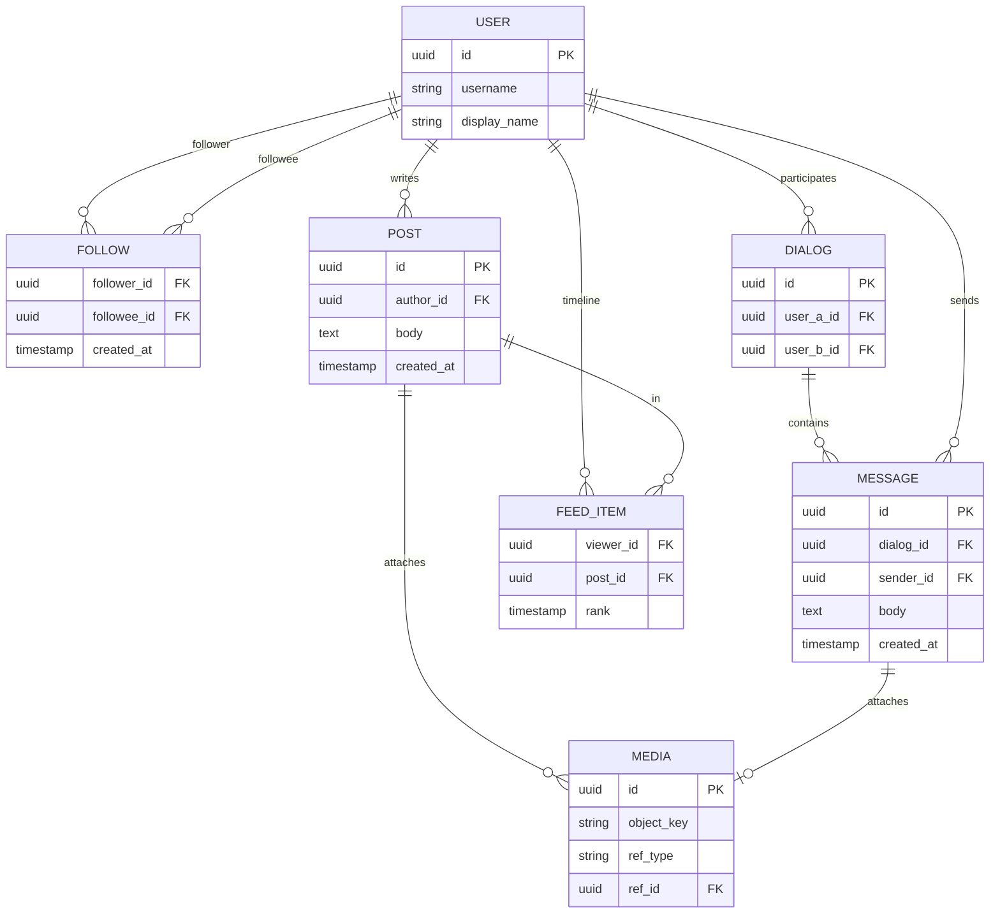
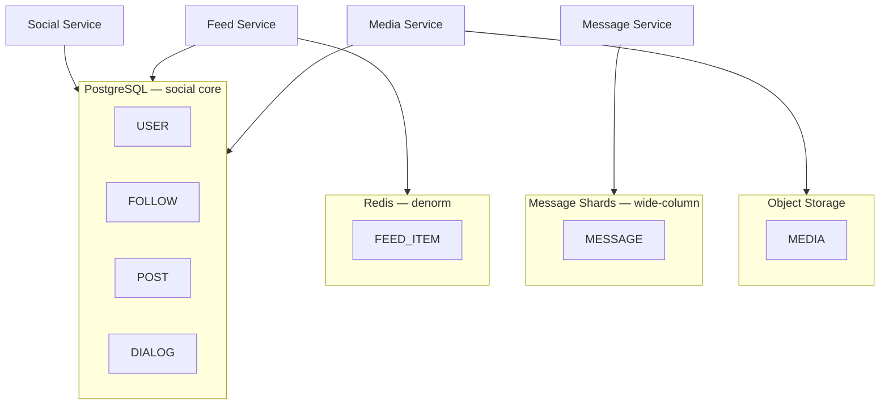
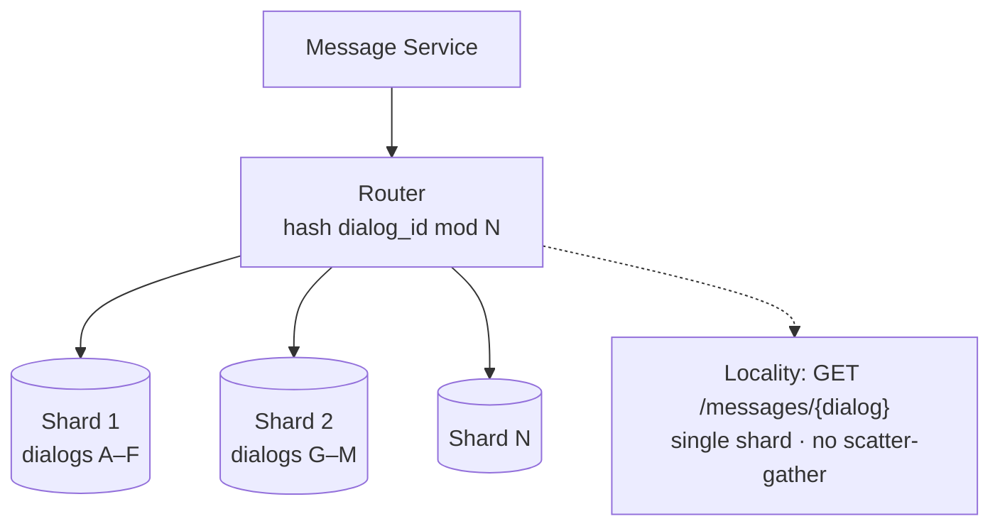
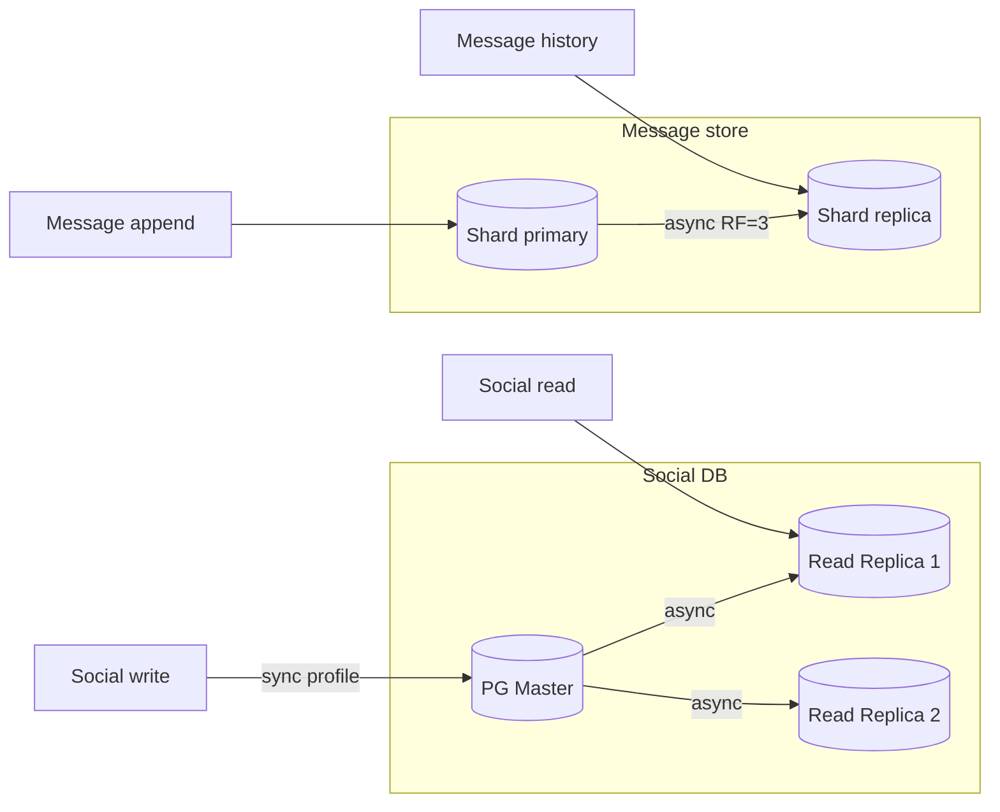
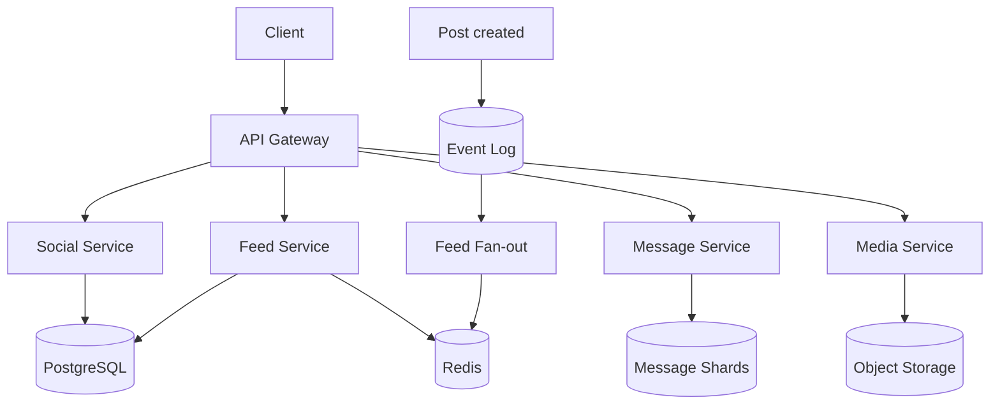
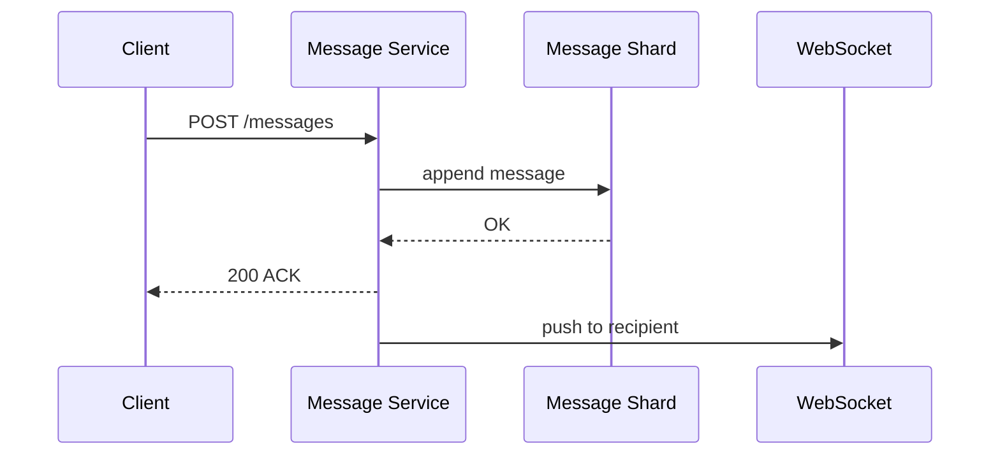

# Пример: VK-like social (capstone)

← [FRAMEWORK.md](../FRAMEWORK.md) · [instagram-feed.md](instagram-feed.md) · [paypal-payments.md](paypal-payments.md)

**80M DAU · friends + feed + messages + media · p99 read ≤ 1s · messages retention 5 лет**

---

## 1. FR

| UC | Функция |
|----|---------|
| UC1 | Профиль, друзья (follow/unfollow) |
| UC2 | Лента постов друзей |
| UC3 | Личные сообщения (1:1) |
| UC4 | Медиа (фото/видео) к постам и сообщениям |

`User M──N User (friends) · User 1──M Post · User 1──M Message · Post 1──M Media`

---

## 2. NFR

### 2.1 Входные допущения

| Параметр | Значение |
|----------|----------|
| DAU | 80M |
| Posts | 0.3 / day / active user |
| Feed reads | 8× / day |
| Messages | 20 / day / active user |
| Avg message | 200 B text + 10% with 500 KB media |
| Retention messages | 5 лет |

### 2.2 Capacity

| Метрика | Формула | Результат |
|---------|---------|-----------|
| Active users/day | 80M DAU | **80M** |
| Post write RPS | 80M × 0.3 ÷ 86_400 | **~280** |
| Message write RPS | 80M × 20 ÷ 86_400 | **~18_500** |
| Feed read RPS | 80M × 8 ÷ 86_400 | **~7_400** |
| Message storage 5y | 18_500 × 200B × 86_400 × 365 × 5 | **~580 TB** text |
| Media storage 5y | 10% × 500KB × msg volume × 5y | **~ petabyte scale** |

**Вывод:** bottleneck — **messages write + storage**, не feed CDN. Graph + messaging shard first.

### 2.3 CAP / Consistency

| Участок | Требование |
|---------|------------|
| friends / profile | strong |
| feed timeline | eventual OK |
| messages delivery | at-least-once, order per dialog |

→ [CAP](../trade-offs/architecture/cap-pacelc-distributed.md)

### 2.4 Latency

#### A. Sync — клиент ждёт

| UC | p99 SLO |
|----|---------|
| UC2 feed page | ≤ 1s |
| UC3 send message | ≤ 500ms ACK |

#### B. Async — клиент не ждёт

| Процесс | SLO |
|---------|-----|
| fan-out feed | секунды OK |
| media transcode | минуты OK |

### 2.5 Throughput

Peak message ~18.5K w/s · feed read ~7.4K r/s · headroom ×3 на праздники.

### 2.6 Availability

| Параметр | Значение |
|----------|----------|
| SLA | 99.95% |
| RPO messages | минуты (async repl) |

### 2.7 Observability

| Signal | Зачем |
|--------|-------|
| p99 feed / messages | latency SLO |
| message queue lag | delivery delay |
| shard balance | hot user detection |

---

## 3. API

| Вызов | UC | Заметка |
|-------|-----|---------|
| `GET /v1/feed` | UC2 | cursor pagination |
| `POST /v1/friends/{id}` | UC1 | follow |
| `POST /v1/messages` | UC3 | sync ACK, async delivery |
| `GET /v1/messages/{dialog}` | UC3 | pull history |
| `POST /v1/media/upload` | UC4 | presigned upload |

Протокол: **REST** + JSON · real-time optional **WebSocket** для UC3 push → [realtime](../trade-offs/api/realtime-transport.md)

---

## 4. Data

**PostgreSQL** — profiles, friends, posts · **message store** — sharded by dialog/user · **object store** — media · **Redis** — denorm feed lists

### ER — core entities

`FOLLOW` — M:N self-ref · `FEED_ITEM` — denorm cache/table для UC2 · `MEDIA.ref_id` → post или message

| Тема | ✅ |
|------|-----|
| SQL graph follows ([sql-nosql](../trade-offs/data/sql-vs-nosql-paradigm.md)) | PostgreSQL |
| Messages volume → wide-column option | Cassandra / Scylla для messages |
| Feed denorm ([norm-denorm](../trade-offs/data/normalization-denormalization.md)) | Redis lists + optional `FEED_ITEM` |

### Размещение по store

profiles / follows / posts — **ACID** · messages — **append-only, TTL 5y** · media — **blob + metadata in PG**

### Шардирование — hash by dialog_id

`DIALOG` metadata в PG · message body в shard по `dialog_id` → [sharding](../trade-offs/data/sharding-partitioning.md)

### Репликация

profile / follows → **sync or strong** · messages → **async RF=3**, RPO минуты OK

### Trade-offs → выбор (data layer)

| Тема | A / B | ✅ Выбор | Почему |
|------|-------|----------|--------|
| Messages store | SQL / wide-column | **wide-column** | 18K w/s, time-range by dialog |
| Social graph | SQL / graph DB | **PostgreSQL** | follows + transactions, scale OK |
| Sharding messages | hash user / dialog | **hash(dialog_id)** | locality per chat |
| Replication | sync / async | **async** messages · **sync** profile | RPO профиля stricter |

---

## 5. HLD

### System context

### UC3 Message flow

---

## 6. Technology choices

### Message store (18K w/s)

| Вопрос | Если да | Если нет |
|--------|---------|----------|
| Write >> read per key? | wide-column | PostgreSQL |
| Time-range by dialog? | partition key dialog_id | — |
| **✅ Выбор** | **Cassandra / Scylla** | append-only, TTL 5y |

### Broker (feed fan-out)

| Вопрос | Если да | Если нет |
|--------|---------|----------|
| Fan-out to N followers? | pub/sub log | queue |
| **✅ Выбор** | **Kafka** | replay, 280 post w/s × followers |

### Cache (feed)

| Вопрос | Выбор |
|--------|-------|
| Hot 15% users = 80% feed reads | Redis cache-aside lists |

### Social graph DB

| Вопрос | Выбор |
|--------|-------|
| ACID follows, joins | PostgreSQL + read replicas |
| Scale | hash(user_id) 4 shards when > single node |

### Infra

| Компонент | Тех | Размер | Откуда |
|-----------|-----|--------|--------|
| Message store | Scylla 6 nodes | ~580 TB+ | §2.2 |
| Social DB | PG 4 shards | profiles, follows | §2.2 posts low |
| Broker | Kafka | fan-out | §2.2 post w/s |
| Cache | Redis | feed hot users | §2.5 read-heavy |
| Object storage | S3 + CDN | media | §2.2 10% media |
| Real-time | WebSocket gateway | UC3 push | §2.4 |
| API | K8s | ~25K combined RPS | §2.5 |

→ [sharding](../trade-offs/data/sharding-partitioning.md) · [messaging](../trade-offs/architecture/messaging-patterns.md) · [cache-eviction](../trade-offs/architecture/cache-eviction-policies.md)

---

← [FRAMEWORK.md](../FRAMEWORK.md)
