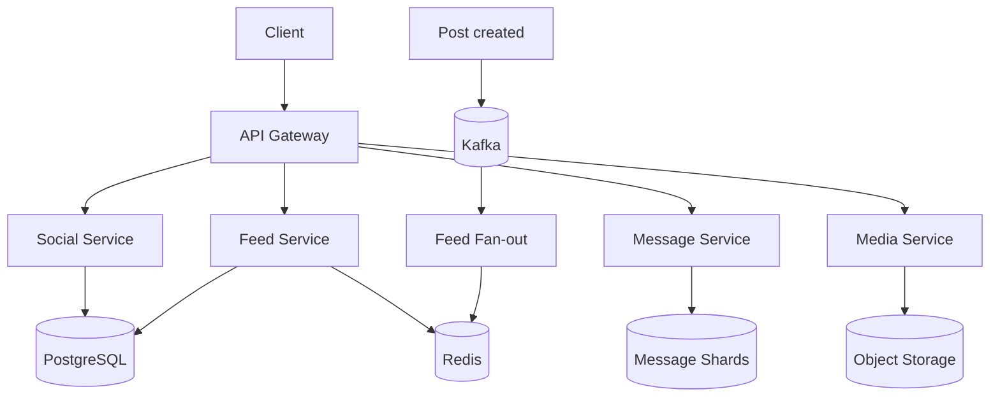
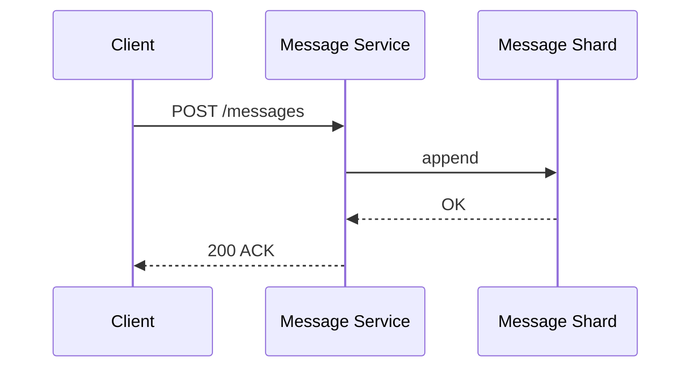

# Пример: VK-like social (capstone)

← [FRAMEWORK.md](../FRAMEWORK.md) · [instagram-feed.md](instagram-feed.md) · [paypal-payments.md](paypal-payments.md)

**Overview:** social graph + feed + messaging · bottleneck = **18.5K msg w/s + 580 TB retention**

**80M DAU · friends + feed + messages + media · messages retention 5 лет**

---

## 1. FR (5–8 min)

| ID | Требование | Пояснение |
|----|------------|-----------|
| **FR-1** | Profile + follow/unfollow | Strong consistency на graph |
| **FR-2** | Feed — посты **только друзей** | Reverse chrono; stale OK |
| **FR-3** | Send message — **sync ACK**, delivery async | 200 после append |
| **FR-4** | Message order **per dialog** | Cross-dialog order не гарантируем |
| **FR-5** | Retention messages **5 лет** | Append-only; TTL после 5y |
| **FR-6** | Hot dialog / celebrity messaging | Один dialog_id — write hotspot |

**Out of scope:** groups, voice/video, E2E encryption, global search

---

## 2. NFR (5–7 min)

### 2.2 Расчёты

| Метрика | Формула | Результат |
|---------|---------|-----------|
| DAU | — | **80M** |
| Message write QPS | 80M × 20 ÷ 86_400 | **~18_500** |
| Post write QPS | 80M × 0.3 ÷ 86_400 | **~280** |
| Feed read QPS | 80M × 8 ÷ 86_400 | **~7_400** |
| Messages storage 5y | volume × retention | **~580 TB** |

**Драйвер:** FR-5/FR-6 — message store sharding first.

### 2.3 SLA / SLO

| Метрика | Цель |
|---------|------|
| Send message p99 | **≤ 500 ms** |
| Feed page p99 | **≤ 1 s** |
| Push delivery p95 | **≤ 2 s** |
| SLA uptime | **99.95%** |
| RPO messages | минуты · RTO **< 30 min** |

### 2.4 Throughput

Peak message **~18.5K w/s** · feed read **~7.4K r/s** · burst ×3 holidays.

### 2.5 Observability

| Метрика | Зачем |
|---------|-------|
| `message_send_p99_ms` | sync ACK SLO |
| `dialog_shard_write_rate` | hot dialog |
| `message_queue_lag_seconds` | push delay |

### 2.6 Master Catalog — pillars

| ID | Pillar | ✅ / — | Направление | Почему §2.2/FR | TOP-3? |
|----|--------|--------|-------------|----------------|--------|
| O1 | Availability | ✅ | async RF=3 — HA | SLA 99.95% | — |
| O2 | Continuity | — | — | не спрашивали | — |
| O3 | DR | ✅ | warm tier | RPO мин, RTO 30 min | **да** |
| S1 | Scalability | ✅ | messages 18.5K w/s, 580 TB | §2.2 | **да** |
| S2 | Consistency | ✅ | strong graph / eventual feed | FR-1, FR-2 | — |
| X1 | Caching | ✅ | cache-aside feed | 7.4K r/s read | — |
| X2 | Processing | ✅ | sync ACK + async push/fan-out | FR-3, FR-2 | **да** |
| X3 | Observability | ✅ | §2.5 metrics | hot dialog alert | — |
| X4 | Security | — | — | out of scope | — |
| X5 | Distributed TX | — | — | no cross-shard money | — |

### 2.7 Processing paths + DR tier

| Path | Core UC | Когда | Механизм |
|------|---------|-------|----------|
| **Sync** | POST message, GET feed | user ждёт ACK | API → shard / cache |
| **Async** | push delivery, post fan-out | FR-3, FR-2 | Kafka + WebSocket |
| **Batch** | archive after 5y TTL | FR-5 retention | cron / cold storage |

**DR tier (O3):** Warm — RPO минуты, RTO 30 min · async repl RF=3.

### 2.8 Bottleneck → START §4

**START:** message write 18.5K w/s + 580 TB → **§4.2** (pillar S1) · **AGENDA:** также O3 → §4.4, X2 → §4.3

---

## 3. HLD (12–15 min)

### 3.1 API

| Endpoint | Зачем | Sync/Async |
|----------|-------|------------|
| `GET /v1/feed` | лента друзей | sync |
| `POST /v1/messages` | send message | sync ACK, async push |
| `GET /v1/messages/{dialog}` | pull history | sync |
| `POST /v1/friends/{id}` | follow | sync |

### 3.2 Data

```
User M──N User (friends) · User 1──M Post · Dialog 1──M Message
Store: PostgreSQL (social) + wide-column (messages) + Redis (feed) + Object storage (media)
```

### 3.3 HLD — схема системы



**UC3 message (data flow):**



### 3.4 TOP-3 pillars · agenda §4

| # | Pillar (ID) | ✅ Направление | §4 (блок) | Почему |
|---|-------------|----------------|-----------|--------|
| 1 | **S1** Scalability | message store 18.5K w/s | §4.2 | bottleneck |
| 2 | **O3** DR | warm tier, RF=3 | §4.4 | §2.3 RPO/RTO |
| 3 | **X2** Processing | sync ACK + async push | §4.3 | FR-3 |

Implementation: Scylla, hash(dialog_id), cache-aside feed — §4, не в TOP-3.

---

## 4. Deep Dive (15–18 min) · образец прохода

*Интервьюер выберет **1–2 темы** — обычно message store (START). Остальное — по вопросам.*

**Типичный сценарий:** START §4.2 · §4.3 или §4.4 — **если поведут**

### §4.2 DB + message store *(образец — блок START)*

Scylla append-only TTL 5y · hash(`dialog_id`) · PG social graph · async RF=3.

### §4.3 Broker *(pull — fan-out, если спросят)*

Kafka — post fan-out 280 w/s × followers.

### §4.4 Failures *(pull — DR/O3, 2–3 строки)*

Hot dialog → rate limit · Push lag → pull works · Duplicate → client dedup.

### Infra sizing

| Компонент | Тех | Размер | Откуда |
|-----------|-----|--------|--------|
| Message store | Scylla 6 nodes | ~580 TB+ | §2.2 retention |
| Social DB | PG 4 shards | profiles, follows | low post w/s |
| Broker | Kafka | fan-out | §2.2 post w/s |
| Cache | Redis | feed hot users | §2.2 feed read |
| API | K8s | ~25K combined RPS | §2.2 total QPS |

---

← [FRAMEWORK.md](../FRAMEWORK.md)
