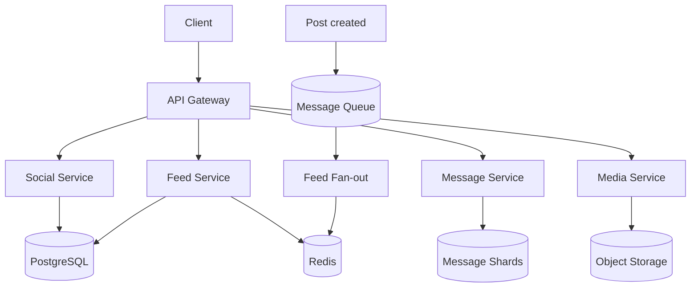
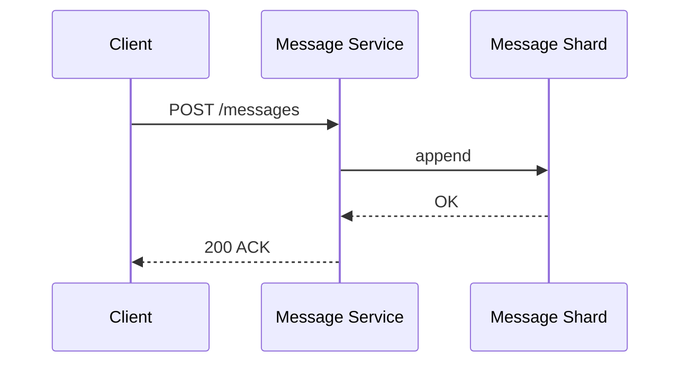

# Пример: VK-like social (capstone)

← [FRAMEWORK.md](../FRAMEWORK.md) · [instagram-feed.md](instagram-feed.md) · [paypal-payments.md](paypal-payments.md)

**Overview:** social graph + feed + messaging

---

## 1. FR (5–8 min)

| ID | Требование | Пояснение |
|----|------------|-----------|
| **FR-1** | Profile + follow/unfollow | Strong consistency на graph |
| **FR-2** | Feed — посты **только друзей** | Reverse chrono; stale OK |
| **FR-3** | Send message — **sync ACK**, delivery async | 200 после append |
| **FR-4** | Message order **per dialog** | Cross-dialog order не гарантируем |
| **FR-5** | Retention messages **5 лет** | Append-only; TTL после 5y |
| **FR-6** | Hot dialog / celebrity messaging | Один dialog_id — write hotspot |

**UC → FR:** UC1 Подписаться → FR-1 · UC2 Лента друзей → FR-2 · UC3 Отправить сообщение → FR-3, FR-4 · UC4 История диалога → FR-5, FR-6

**Акторы:** User · Client · Social Service · Feed Service · Message Service · Media Service

**Интеграции:** Object storage — media · Push/WebSocket — delivery async (FR-3)

**Out of scope:** groups, voice/video, E2E encryption, global search

**ER:** User M──N User · User 1──M Post · Dialog 1──M Message

---

## 2. NFR (5–7 min)

### 2.1 Цифры на доску

**Допущения:** 80M DAU · messages retention 5 лет · friends + feed + messages + media

| Вопрос | Формула / допущение | Результат | На доске |
|--------|---------------------|-----------|----------|
| DAU | — | **80M** | 80M DAU |
| Message write QPS | 80M × 20 ÷ 86_400 | **~18_500** | ~18.5K w/s |
| Post write QPS | 80M × 0.3 ÷ 86_400 | **~280** | ~280 w/s |
| Feed read QPS | 80M × 8 ÷ 86_400 | **~7_400** | ~7.4K r/s |
| Messages storage 5y | volume × retention | **~580 TB** | ~580 TB |
| Peak messages | avg × burst ×3 holidays | **~55K w/s** | burst ×3 |
| Send message p99 | 2× SSD + DC ~0.5 ms | **≤ 500 ms** | p99 ≤ 500 ms |
| Feed page p99 | cache hit + SSD | **≤ 1 s** | p99 ≤ 1 s |
| SLA uptime | product | **99.95%** | 99.95% |
| RPO / RTO | messages | мин · **< 30 min** | RPO мин · RTO 30m |

**Драйвер:** FR-5/FR-6 — message store sharding first.

### 2.2 Pillars + вывод

| ID | Pillar | Что спросят | На доске | типично для |
|----|--------|-------------|----------|-------------|
| O1 | Availability | async RF=3 — HA | ✅ | — |
| O2 | Continuity | — | — | — |
| O3 | DR | warm tier | **TOP-3** | write-heavy |
| S1 | Scalability | messages 18.5K w/s, 580 TB | **TOP-3** | write-heavy |
| S2 | Consistency | strong graph / eventual feed | ✅ | write-heavy |
| X1 | Caching | cache-aside feed | ✅ | read-heavy |
| X2 | Processing | sync ACK + async push/fan-out | **TOP-3** | write-heavy |
| X3 | Observability | hot dialog alert | ✅ | — |
| X4 | Security | — | — | — |
| X5 | Distributed TX | — | — | CP/money |

**Вывод:** message write 18.5K w/s + 580 TB → **§4.2** · **TOP-3:** S1 · O3 · X2

---

## 3. HLD (12–15 min)

### 3.1 API

| Endpoint | Зачем | Sync/Async |
|----------|-------|------------|
| `GET /v1/feed` | лента друзей | sync |
| `POST /v1/messages` | send message | sync ACK, async push |
| `GET /v1/messages/{dialog}` | pull history | sync |
| `POST /v1/friends/{id}` | follow | sync |

### 3.2 Data

```
User M──N User · User 1──M Post · Dialog 1──M Message  *(ER — §1)*
Store roles: SQL DB (social) · wide-column (messages) · Cache (feed) · Object storage (media)
```

### 3.3 HLD — схема системы



**UC3 message (data flow):**



---

## 4. Deep Dive (15–18 min) · образец прохода

*Интервьюер выберет **1–2 темы** — обычно message store. Остальное — по вопросам.*

**Типичный сценарий:** §4.2 · §4.3 или §4.4 — **если поведут**

### §4.2 DB + message store *(образец — единственный блок на доске)*

Scylla append-only TTL 5y · hash(`dialog_id`) · PG social graph · async RF=3.

**Pull (если спросят):** post fan-out queue (X2) · DR failures: hot dialog rate limit, push lag · infra sizing — таблица ниже

### Infra sizing *(pull, ~2 min)*

| Компонент | Тех | Размер | Откуда |
|-----------|-----|--------|--------|
| Message store | Scylla 6 nodes | ~580 TB+ | §2.1 retention |
| Social DB | PG 4 shards | profiles, follows | low post w/s |
| Broker | Kafka | fan-out | §2.1 post w/s |
| Cache | Redis | feed hot users | §2.1 feed read |
| API | K8s | ~25K combined RPS | §2.1 total QPS |

---

← [FRAMEWORK.md](../FRAMEWORK.md)
