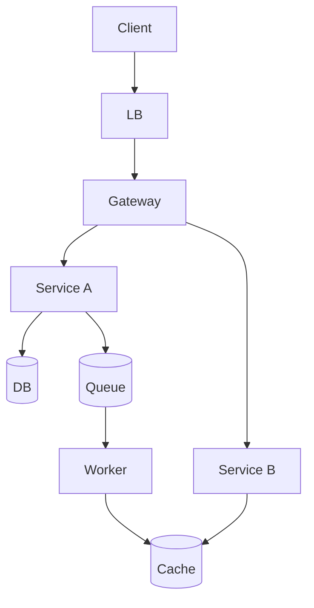

# Шаг 3 — High-level design (12–15 min)

← [FRAMEWORK](../FRAMEWORK.md)

**Фокус шага:** только **визуализация** — API, schema, diagram. Планирование (цифры, pillars, TOP-3, bottleneck) уже в [шаге 2](02-non-functional-requirements.md).

**Имена на HLD:** роли компонентов и **типы** store (SQL DB, Cache, Queue) — OK. **Trade-off и вендоры** (cache-aside vs write-through, Kafka vs Rabbit) — только [шаг 4](04-deep-dive.md).

## 3.1 API — 2–3 эндпоинта

| Endpoint | Зачем | Sync/Async |
|----------|-------|------------|
| `POST …` | core write | sync ACK |
| `GET …` | core read | sync |

Pagination, idempotency — по запросу в Deep Dive.

## 3.2 Data — schema

ER из §1; здесь — **типы store** (без trade-off деталей):

```
User 1──M Post · User M──N User
Store roles: SQL DB (graph) · Object storage (media) · Cache (feed denorm)
```

Индексы / поля — Deep Dive §4.2 по запросу.

## 3.3 HLD — схема системы

**На доске:** task-specific diagram — LB → 2–4 сервиса → DB / Cache / Queue.



**Data flow (1 главный UC)** — optional.

---

← [02 — NFR](02-non-functional-requirements.md) · [FRAMEWORK](../FRAMEWORK.md) · [04 — Deep Dive](04-deep-dive.md) →

Примеры: [instagram §3](../examples/instagram-feed.md#3-hld) · [paypal §3](../examples/paypal-payments.md#3-hld) · [vk §3](../examples/vk-social.md#3-hld) · [open-world §3](../examples/open-world-mobile-game.md#3-hld) · [nutrition §3](../examples/nutrition-mobile-app.md#3-hld)
