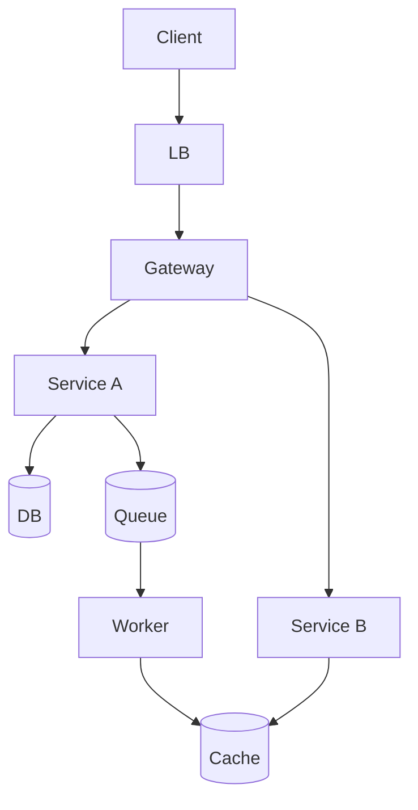

# Шаг 3 — High-level design (12–15 min)

← [FRAMEWORK](../FRAMEWORK.md)

Слияние API + Data + **схема системы**. **§3.4 TOP-3 = 3 pillars из Master Catalog §2.6** (не «push vs pull» напрямую).

Шаг 3 рисует HLD; **§3.4 формирует AGENDA для шага 4** (не дублирует §2.8 START).

## 3.1 API — 2–3 эндпоинта

| Endpoint | Зачем | Sync/Async |
|----------|-------|------------|
| `POST …` | core write | sync ACK |
| `GET …` | core read | sync |

Pagination, idempotency — по запросу в Deep Dive.

## 3.2 Data — schema

```
User 1──M Post · User M──N User
Store: PostgreSQL (graph) + Object storage (media) + Redis (feed denorm)
```

ER / indexing — Deep Dive §4.2 по запросу.

## 3.3 HLD — схема системы

**На доске:** task-specific diagram — LB → 2–4 сервиса → DB / Cache / Queue.



**Data flow (1 главный UC)** — optional.

## 3.4 TOP-3 pillars · agenda для §4

**Ровно 3 строки** — pillar ID + направление. Implementation (cache-aside, Kafka…) → §4.

| Роль | Секция | Вопрос |
|------|--------|--------|
| START | §2.8 | С чего **начать** Deep Dive? |
| AGENDA | §3.4 | Что **обязательно** проговорить? |
| DETAIL | §4.x | Как **обосновать** (trade-offs)? |

Колонка **§4** — блок, где раскрывать pillar (*может отличаться от START §2.8*).

| # | Pillar (ID) | ✅ Направление | §4 (блок) | Почему |
|---|-------------|----------------|-----------|--------|
| 1 | X1 Caching | CDN + cache-aside | §4.2 | §2.2 bandwidth |
| 2 | S1 Scalability | read path | §4.2 | bottleneck |
| 3 | X2 Processing | async fan-out | §4.3 | FR |

**Не писать в TOP-3:** push vs pull, hash shard — это **implementation** под S1/X1/X2.

### Типичные TOP-3 по типу задачи

| Тип | Pillar IDs |
|-----|------------|
| Read-heavy | **X1** · **S1** · **X2** |
| CP / money | **O3** · **S2** · **X5** |
| Write-heavy | **S1** · **O3** · **X2** |

---

← [02 — NFR](02-non-functional-requirements.md) · [FRAMEWORK](../FRAMEWORK.md) · [04 — Deep Dive](04-deep-dive.md) →

Примеры: [instagram §3](../examples/instagram-feed.md#3-hld) · [paypal §3](../examples/paypal-payments.md#3-hld) · [vk §3](../examples/vk-social.md#3-hld)
