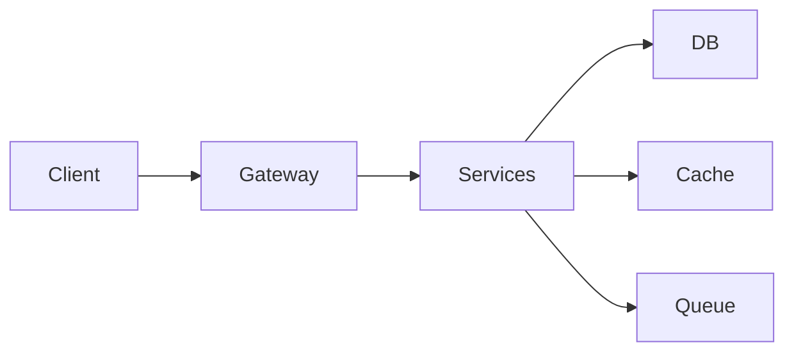
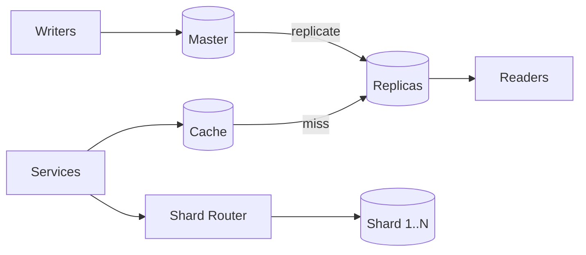

# Шаг 5 — High-Level Design

← [FRAMEWORK](../FRAMEWORK.md)

## Trade-offs (перед схемой)

| Тема | Файл |
|------|------|
| Monolith / micro | [monolith-micro](../trade-offs/architecture/monolith-microservices.md) |
| Stateless / stateful | [stateless](../trade-offs/architecture/stateless-stateful.md) |
| L4 / L7 | [lb](../trade-offs/architecture/load-balancing-l4-l7.md) |
| Messaging | [messaging](../trade-offs/architecture/messaging-patterns.md) |
| Saga / outbox | [saga-outbox](../trade-offs/architecture/saga-vs-outbox.md) |
| Orchestration / choreography | [orchestration](../trade-offs/architecture/orchestration-choreography-saga.md) |
| Concurrency / parallelism | [concurrency](../trade-offs/architecture/concurrency-vs-parallelism.md) |
| Coordination | [coordination](../trade-offs/architecture/distributed-coordination.md) |
| ETL | [etl](../trade-offs/architecture/etl-pipeline-pattern.md) |

## Схема

Шаблон: **trade-offs из шага 4 → выбор → диаграмма** (см. [пример](../examples/instagram-feed.md#5-hld)).

### Общая

### Data layer (после trade-offs)

| Тема | Файл |
|------|------|
| Replication | [replication](../trade-offs/data/replication-sync-async.md) |
| Master / multi-master | [master-slave](../trade-offs/data/master-slave-multi-master.md) |
| Sharding | [sharding](../trade-offs/data/sharding-partitioning.md) |
| Caching | [cache](../trade-offs/architecture/caching-patterns.md) |

## Data flow (1 UC)

| # | Компонент | Действие |
|---|-----------|----------|
| 1 | … | … |
| 2 | … | … |

**При сбое:** деградация из trade-offs шага 2 (Reliability).

---

← [04 — Data](04-data-model.md) · [FRAMEWORK](../FRAMEWORK.md)

Примеры: [instagram-feed.md](../examples/instagram-feed.md) · [paypal-payments.md](../examples/paypal-payments.md)
